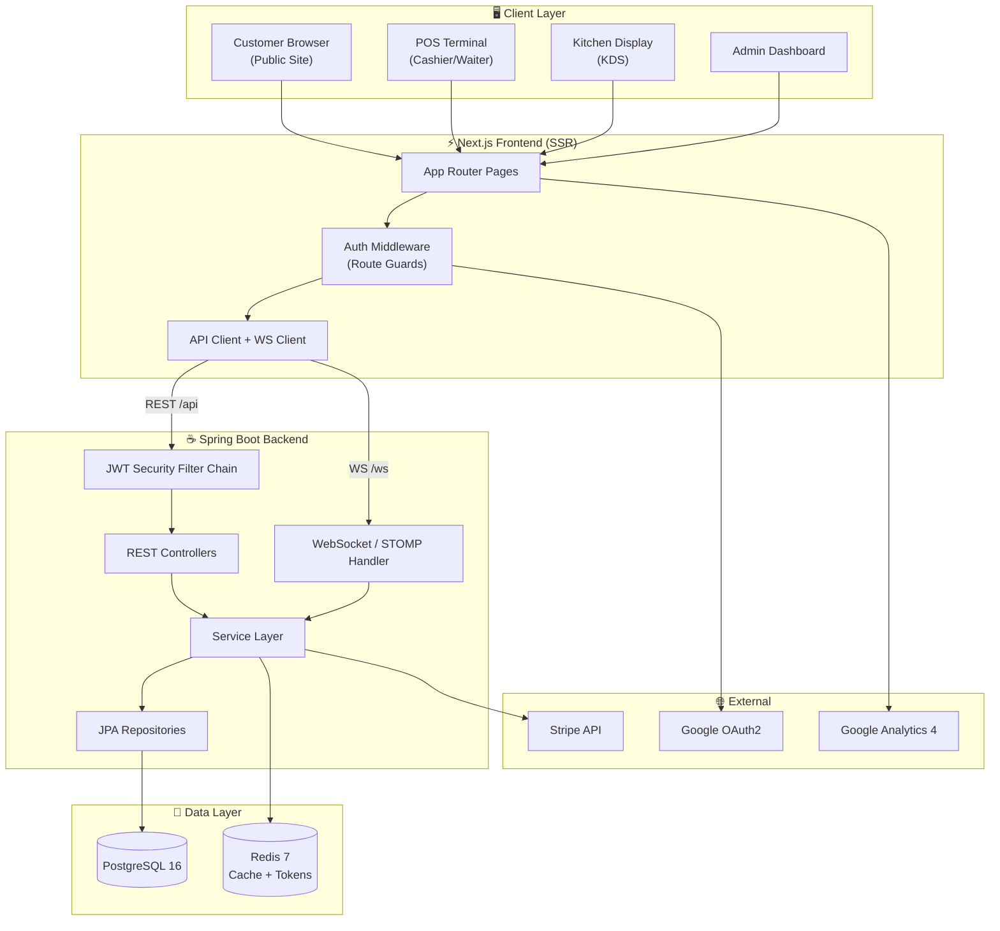
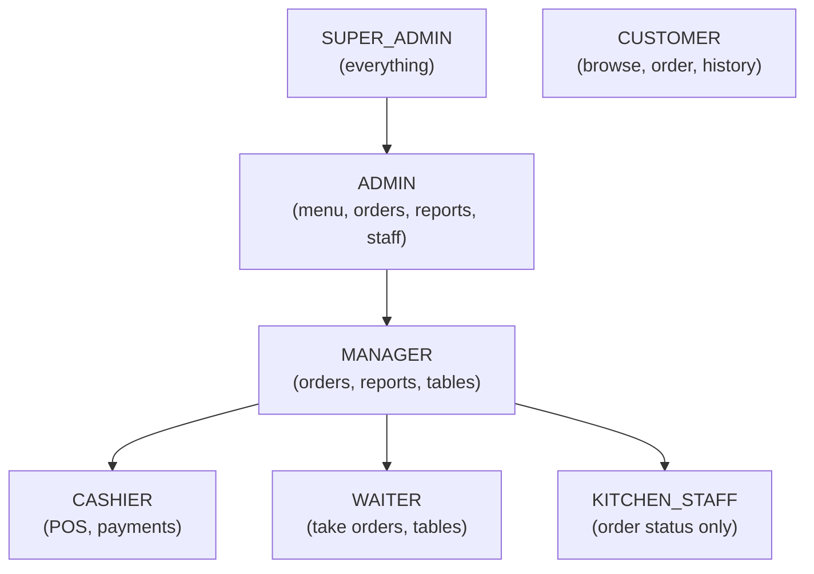
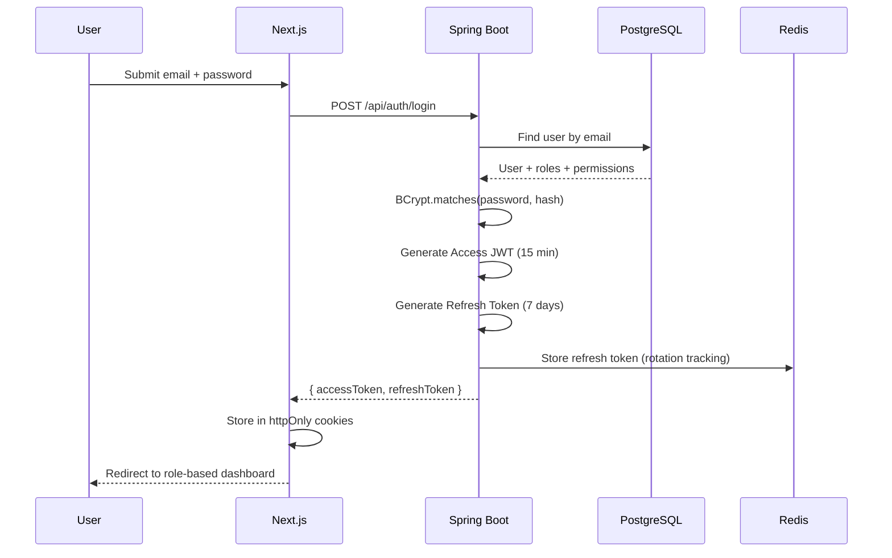
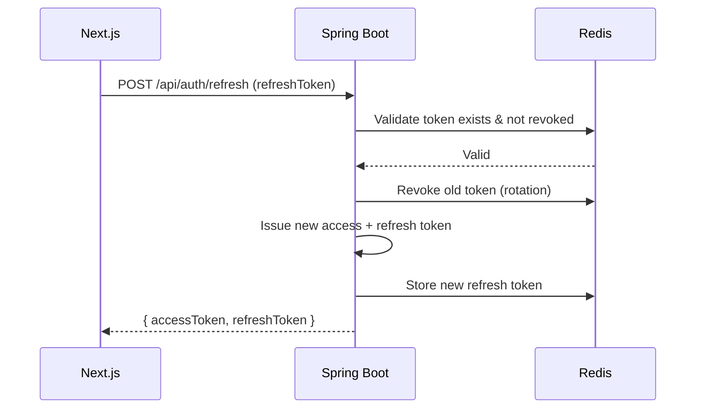
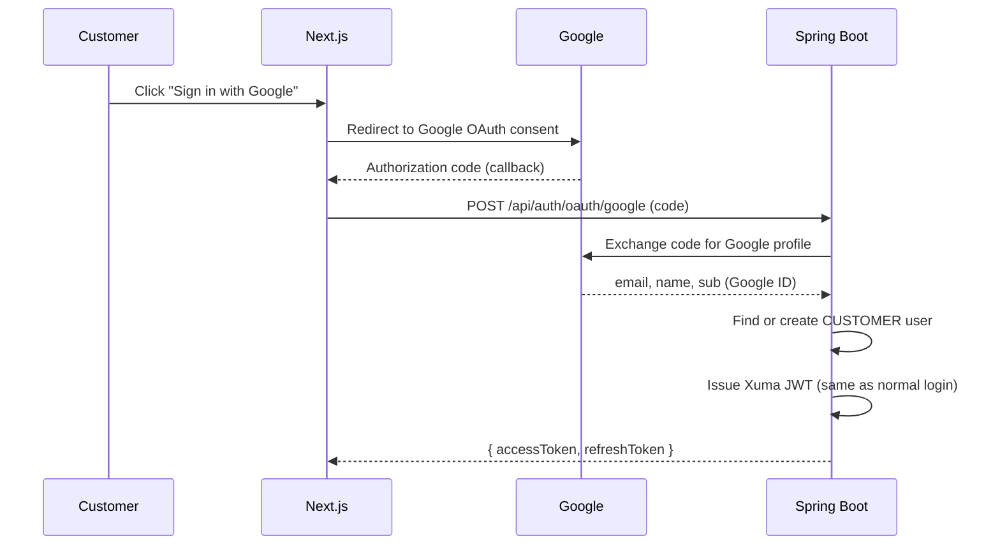
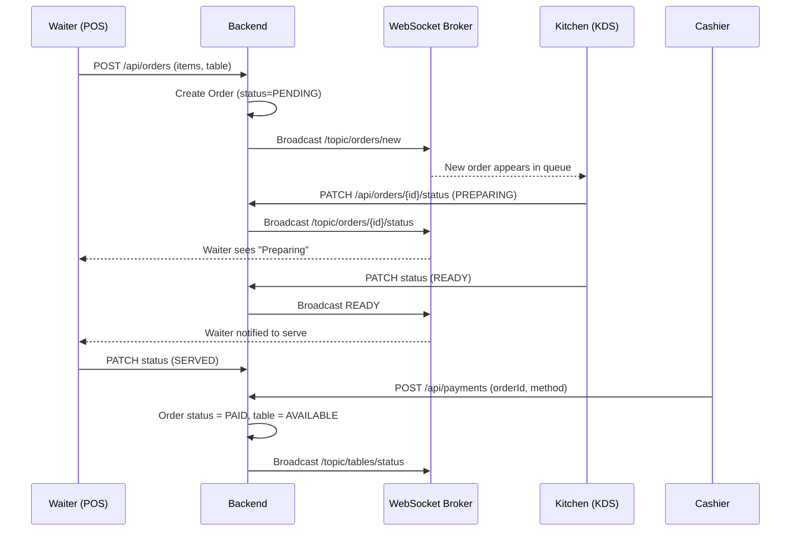
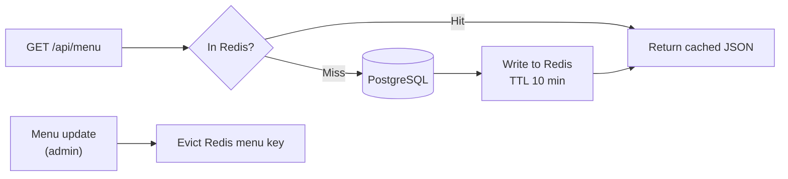
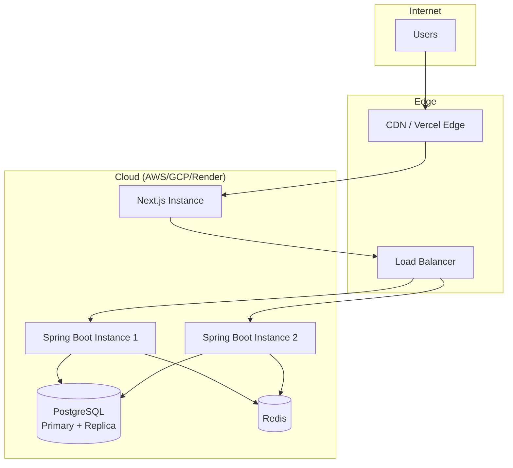

# 🏛️ Xuma Restaurant POS — System Design Document

**Role:** Software Architect / Principal Engineer
**Document:** 1 of 4 — System Design
**Status:** Production-Grade Specification
**Auth Decision:** Manual Spring Security 6 + JWT (No Keycloak)

> **For the build agent:** This document defines the *what* and the *why* of the system. Read documents 2 (Class Diagram), 3 (Entity Management), and 4 (Code Architecture) together with this one. All entity names, package names, and role names are consistent across all four files.

---

## 1. Architecture Decision Record (ADR)

### ADR-001: Authentication — Manual RBAC over Keycloak
**Decision:** Use Spring Security 6 + JWT with a self-managed `users` / `roles` / `permissions` schema.
**Rationale:** Single-application system. Keycloak adds an extra server + database to operate, which is unjustified complexity for one POS app. Spring Security gives us full RBAC, method-level authorization, and OAuth2 social login natively.
**Consequence:** We own the security code; we must follow security best practices (BCrypt, short-lived access tokens, rotating refresh tokens).

### ADR-002: Frontend — Next.js App Router with SSR
**Decision:** Next.js 14+ App Router, TypeScript, Tailwind CSS.
**Rationale:** Sub-1s loads via SSR/streaming, native SEO, route-level middleware for role guards.

### ADR-003: Database — PostgreSQL
**Decision:** PostgreSQL 16. Relational data (orders, items, payments) needs ACID guarantees.

### ADR-004: Real-Time — WebSocket (STOMP)
**Decision:** Spring WebSocket + STOMP for live kitchen/order/table updates. SSE considered but WebSocket chosen for bidirectional needs.

### ADR-005: Caching — Redis
**Decision:** Redis for menu caching, session/refresh-token blacklist, and rate limiting.

---

## 2. High-Level System Architecture (C4 — Container View)

---

## 3. Logical Component Breakdown

### 3.1 Frontend Components (Next.js)
| Component | Responsibility |
|---|---|
| Public Site | Homepage, Menu, Reservation, Customer Order |
| Auth Module | Login, Register, OAuth callback, token storage (httpOnly cookie) |
| POS Terminal | Order building, table selection, payment, receipt |
| Kitchen Display (KDS) | Live order queue, status updates |
| Admin Dashboard | Menu CRUD, staff, reports, analytics |
| Middleware | Edge route guard — checks JWT + role before page loads |

### 3.2 Backend Components (Spring Boot)
| Component | Responsibility |
|---|---|
| Security Layer | JWT validation, role extraction, method-level `@PreAuthorize` |
| Auth Service | Login, register, refresh, OAuth2 social login |
| Menu Service | Menu/category CRUD, availability, caching |
| Order Service | Order lifecycle + state machine + WS broadcast |
| Payment Service | Stripe integration, receipt generation |
| Table Service | Table status, reservations |
| Report Service | Aggregated analytics queries |
| Staff Service | Staff management, performance metrics |
| WebSocket Layer | STOMP broker for `/topic/*` channels |

---

## 4. Role-Based Access Control (RBAC) Model

### 4.1 Role Hierarchy

### 4.2 Permission Matrix
| Permission | SUPER_ADMIN | ADMIN | MANAGER | CASHIER | WAITER | KITCHEN | CUSTOMER |
|---|:-:|:-:|:-:|:-:|:-:|:-:|:-:|
| `menu:read` | ✅ | ✅ | ✅ | ✅ | ✅ | ✅ | ✅ |
| `menu:write` | ✅ | ✅ | ❌ | ❌ | ❌ | ❌ | ❌ |
| `order:create` | ✅ | ✅ | ✅ | ✅ | ✅ | ❌ | ✅ |
| `order:update_status` | ✅ | ✅ | ✅ | ✅ | ✅ | ✅ | ❌ |
| `order:cancel` | ✅ | ✅ | ✅ | ✅ | ❌ | ❌ | ❌ |
| `payment:process` | ✅ | ✅ | ✅ | ✅ | ❌ | ❌ | ❌ |
| `table:manage` | ✅ | ✅ | ✅ | ❌ | ✅ | ❌ | ❌ |
| `staff:manage` | ✅ | ✅ | ❌ | ❌ | ❌ | ❌ | ❌ |
| `report:view` | ✅ | ✅ | ✅ | ❌ | ❌ | ❌ | ❌ |
| `system:config` | ✅ | ❌ | ❌ | ❌ | ❌ | ❌ | ❌ |

> **Design principle:** Authorize on **permissions**, not roles, in the code (`@PreAuthorize("hasAuthority('menu:write')")`). Roles are just bundles of permissions. This lets you add roles later without touching controller code.

---

## 5. Authentication Flows

### 5.1 Email/Password Login

### 5.2 Token Refresh (Rotation)

### 5.3 Google Social Login (No Keycloak)

---

## 6. Order Lifecycle Flow (Real-Time)

---

## 7. Data Flow & Caching Strategy

**Cache keys:**
- `menu:full` — entire menu (TTL 10 min, evicted on any menu write)
- `menu:featured` — featured items (TTL 10 min)
- `refresh:{userId}:{tokenId}` — refresh token store
- `ratelimit:{ip}` — login rate limiting

---

## 8. Non-Functional Requirements

| Category | Requirement |
|---|---|
| **Performance** | Page load < 1s, API p95 < 200ms, WS latency < 100ms |
| **Scalability** | Stateless backend (horizontal scaling), 500+ concurrent users |
| **Security** | BCrypt (cost 12), JWT 15min access / 7day refresh, HTTPS only, CORS locked, SQL injection safe (JPA), rate limiting on auth endpoints, httpOnly+Secure+SameSite cookies |
| **Availability** | 99.9% uptime, health checks, graceful shutdown |
| **Observability** | Spring Actuator, structured logging (Logback JSON), distributed tracing (Micrometer) |
| **Data** | Daily automated PG backups, soft-delete for orders/menu (audit trail) |
| **Accessibility** | WCAG 2.1 AA on all customer-facing pages |

---

## 9. Deployment Topology

**Backend is stateless** → scale horizontally behind the load balancer. Sessions live in JWT + Redis, not in app memory.

---

## 10. Security Hardening Checklist

- [ ] Passwords hashed with BCrypt (strength 12)
- [ ] Access tokens expire in 15 minutes
- [ ] Refresh tokens rotate on every use, stored hashed in Redis
- [ ] All endpoints HTTPS-only in production
- [ ] CORS restricted to known frontend origin
- [ ] Rate limiting on `/api/auth/**` (5 attempts / 15 min per IP)
- [ ] JWT secret from environment, min 256-bit, rotated periodically
- [ ] Cookies: `httpOnly`, `Secure`, `SameSite=Strict`
- [ ] Input validation via `@Valid` + Bean Validation on all DTOs
- [ ] No sensitive data in logs (mask emails, never log tokens)
- [ ] Method-level `@PreAuthorize` on every protected service method
- [ ] CSRF protection enabled for cookie-based auth
- [ ] Stripe webhooks signature-verified

---

*End of Document 1 — System Design. Continue to Document 2: Class Diagram & Relationships.*
