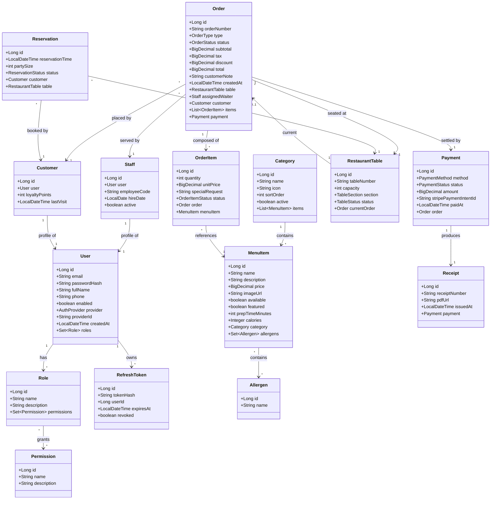
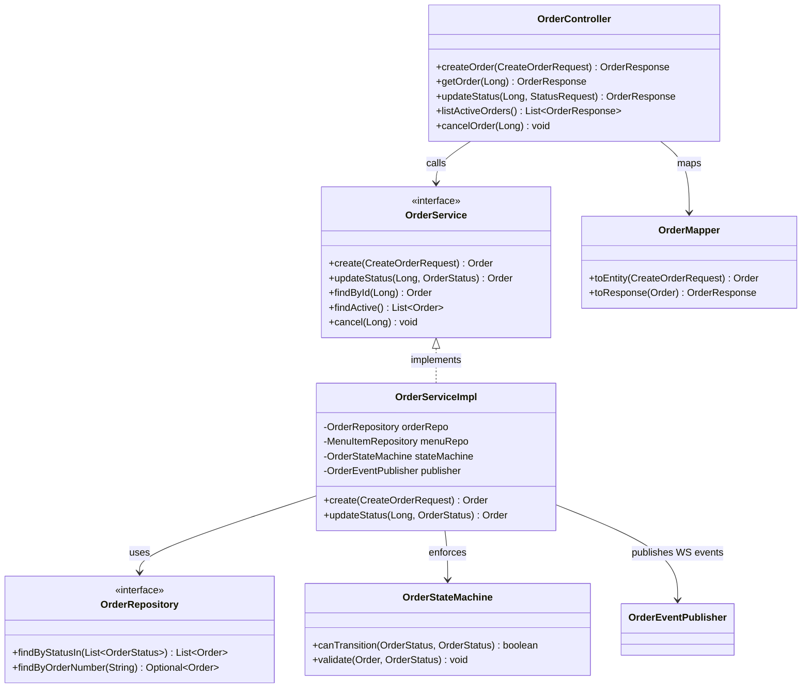
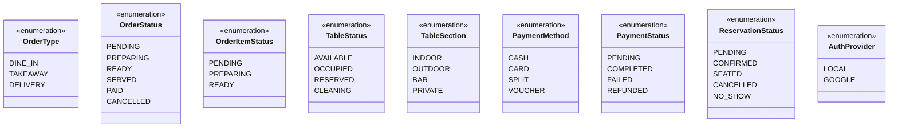
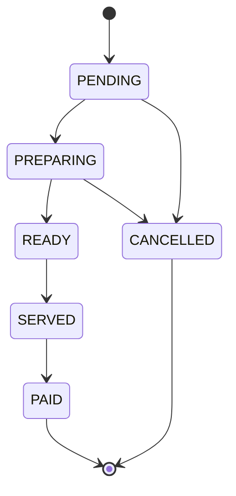

# 🧩 Xuma Restaurant POS — Class Diagram & Relationships

**Role:** Software Architect / Principal Engineer
**Document:** 2 of 4 — Class Diagram & Relationships
**Layer Convention:** Domain (Entity) → Repository → Service → Controller → DTO

> **For the build agent:** This document shows the object model and how classes relate. Entity field details and DDL are in Document 3. Use these class names *exactly* in code.

---

## 1. Domain Model — Full Class Diagram



---

## 2. Relationship Cardinality Reference

| From | To | Type | Notes |
|---|---|---|---|
| User → Role | Many-to-Many | Join table `user_roles` |
| Role → Permission | Many-to-Many | Join table `role_permissions` |
| User → RefreshToken | One-to-Many | Cascade delete |
| Staff → User | One-to-One | Staff profile links identity |
| Customer → User | One-to-One | Customer profile links identity |
| Category → MenuItem | One-to-Many | `category_id` FK on menu_item |
| MenuItem → Allergen | Many-to-Many | Join table `menu_item_allergens` |
| Order → OrderItem | One-to-Many | Composition (cascade ALL, orphan removal) |
| OrderItem → MenuItem | Many-to-One | `menu_item_id` FK |
| Order → RestaurantTable | Many-to-One | Nullable (takeaway/delivery) |
| Order → Staff | Many-to-One | `assigned_waiter_id` FK, nullable |
| Order → Customer | Many-to-One | Nullable (walk-in) |
| Order → Payment | One-to-One | `order_id` FK on payment |
| Payment → Receipt | One-to-One | Generated after payment |
| Reservation → Customer | Many-to-One | |
| Reservation → RestaurantTable | Many-to-One | |

---

## 3. Layered Class Structure (Per Domain)

Each domain follows the same vertical slice. Example shown for **Order**:



> **Replicate this slice** for Menu, Table, Payment, Staff, Report, Auth domains.

---

## 4. Enums (Value Types)



---

## 5. Order State Machine (Allowed Transitions)



**Enforcement:** `OrderStateMachine.canTransition()` rejects any transition not in this diagram (e.g., `PAID → PREPARING` throws `IllegalStateTransitionException`).

---

## 6. DTO ↔ Entity Mapping Rule

- **Controllers** never expose entities. They accept `*Request` DTOs and return `*Response` DTOs.
- **Mappers** (MapStruct recommended) convert between layers.
- **Services** work with entities internally.

```
HTTP Request → Request DTO → [Mapper] → Entity → [Service/Repo] → Entity → [Mapper] → Response DTO → HTTP Response
```

---

*End of Document 2 — Class Diagram & Relationships. Continue to Document 3: Entity Management.*
