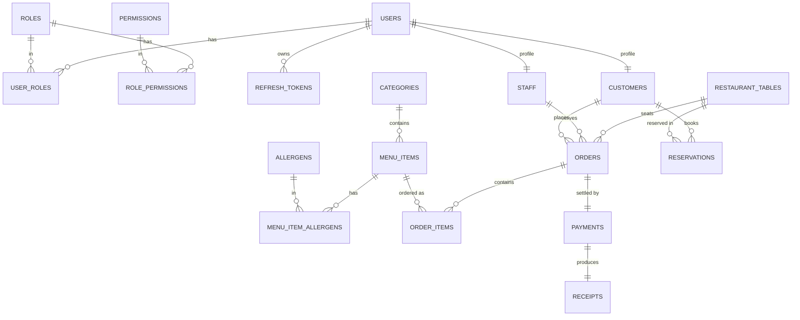

# 💾 Xuma Restaurant POS — Entity Management

**Role:** Software Architect / Principal Engineer
**Document:** 3 of 4 — Entity Management
**ORM:** Spring Data JPA / Hibernate 6
**DB:** PostgreSQL 16

> **For the build agent:** These are the exact JPA entities. Use `Long` IDs with `IDENTITY` generation. Add `@CreationTimestamp` / `@UpdateTimestamp` where shown. All money fields are `BigDecimal` with `precision=10, scale=2`. Soft-delete is applied to Order and MenuItem.

---

## 1. Base Auditing (Mapped Superclass)

Every entity extends this for created/updated tracking.

```java
@MappedSuperclass
@Getter @Setter
public abstract class Auditable {

    @CreationTimestamp
    @Column(name = "created_at", updatable = false, nullable = false)
    private LocalDateTime createdAt;

    @UpdateTimestamp
    @Column(name = "updated_at", nullable = false)
    private LocalDateTime updatedAt;

    @Version
    private Long version; // optimistic locking
}
```

---

## 2. Auth & Identity Entities

### 2.1 User
```java
@Entity
@Table(name = "users", indexes = {
    @Index(name = "idx_user_email", columnList = "email", unique = true)
})
@Getter @Setter @NoArgsConstructor
public class User extends Auditable {

    @Id @GeneratedValue(strategy = GenerationType.IDENTITY)
    private Long id;

    @Column(nullable = false, unique = true, length = 255)
    private String email;

    @Column(name = "password_hash")
    private String passwordHash; // null for OAuth-only users

    @Column(name = "full_name", nullable = false, length = 150)
    private String fullName;

    @Column(length = 30)
    private String phone;

    @Column(nullable = false)
    private boolean enabled = true;

    @Enumerated(EnumType.STRING)
    @Column(nullable = false, length = 20)
    private AuthProvider provider = AuthProvider.LOCAL;

    @Column(name = "provider_id")
    private String providerId; // Google "sub" for OAuth users

    @ManyToMany(fetch = FetchType.EAGER)
    @JoinTable(
        name = "user_roles",
        joinColumns = @JoinColumn(name = "user_id"),
        inverseJoinColumns = @JoinColumn(name = "role_id")
    )
    private Set<Role> roles = new HashSet<>();
}
```

### 2.2 Role
```java
@Entity
@Table(name = "roles")
@Getter @Setter @NoArgsConstructor
public class Role {

    @Id @GeneratedValue(strategy = GenerationType.IDENTITY)
    private Long id;

    @Column(nullable = false, unique = true, length = 50)
    private String name; // SUPER_ADMIN, ADMIN, MANAGER, CASHIER, WAITER, KITCHEN_STAFF, CUSTOMER

    @Column(length = 255)
    private String description;

    @ManyToMany(fetch = FetchType.EAGER)
    @JoinTable(
        name = "role_permissions",
        joinColumns = @JoinColumn(name = "role_id"),
        inverseJoinColumns = @JoinColumn(name = "permission_id")
    )
    private Set<Permission> permissions = new HashSet<>();
}
```

### 2.3 Permission
```java
@Entity
@Table(name = "permissions")
@Getter @Setter @NoArgsConstructor
public class Permission {

    @Id @GeneratedValue(strategy = GenerationType.IDENTITY)
    private Long id;

    @Column(nullable = false, unique = true, length = 50)
    private String name; // menu:read, menu:write, order:create, etc.

    @Column(length = 255)
    private String description;
}
```

### 2.4 RefreshToken
```java
@Entity
@Table(name = "refresh_tokens", indexes = {
    @Index(name = "idx_refresh_user", columnList = "user_id")
})
@Getter @Setter @NoArgsConstructor
public class RefreshToken {

    @Id @GeneratedValue(strategy = GenerationType.IDENTITY)
    private Long id;

    @Column(name = "token_hash", nullable = false, unique = true)
    private String tokenHash; // store hash, never raw token

    @Column(name = "user_id", nullable = false)
    private Long userId;

    @Column(name = "expires_at", nullable = false)
    private LocalDateTime expiresAt;

    @Column(nullable = false)
    private boolean revoked = false;
}
```

> **Note:** Refresh tokens are also mirrored in Redis for fast revocation lookup. PostgreSQL is the durable source of truth.

---

## 3. Profile Entities

### 3.1 Staff
```java
@Entity
@Table(name = "staff")
@Getter @Setter @NoArgsConstructor
public class Staff extends Auditable {

    @Id @GeneratedValue(strategy = GenerationType.IDENTITY)
    private Long id;

    @OneToOne(fetch = FetchType.LAZY)
    @JoinColumn(name = "user_id", nullable = false, unique = true)
    private User user;

    @Column(name = "employee_code", unique = true, length = 20)
    private String employeeCode; // EMP-001

    @Column(name = "hire_date")
    private LocalDate hireDate;

    @Column(nullable = false)
    private boolean active = true;
}
```

### 3.2 Customer
```java
@Entity
@Table(name = "customers")
@Getter @Setter @NoArgsConstructor
public class Customer extends Auditable {

    @Id @GeneratedValue(strategy = GenerationType.IDENTITY)
    private Long id;

    @OneToOne(fetch = FetchType.LAZY)
    @JoinColumn(name = "user_id", nullable = false, unique = true)
    private User user;

    @Column(name = "loyalty_points", nullable = false)
    private int loyaltyPoints = 0;

    @Column(name = "last_visit")
    private LocalDateTime lastVisit;
}
```

---

## 4. Menu Entities

### 4.1 Category
```java
@Entity
@Table(name = "categories")
@Getter @Setter @NoArgsConstructor
public class Category extends Auditable {

    @Id @GeneratedValue(strategy = GenerationType.IDENTITY)
    private Long id;

    @Column(nullable = false, length = 100)
    private String name;

    @Column(length = 50)
    private String icon;

    @Column(name = "sort_order", nullable = false)
    private int sortOrder = 0;

    @Column(nullable = false)
    private boolean active = true;

    @OneToMany(mappedBy = "category", cascade = CascadeType.ALL, orphanRemoval = true)
    private List<MenuItem> items = new ArrayList<>();
}
```

### 4.2 MenuItem (with soft delete)
```java
@Entity
@Table(name = "menu_items", indexes = {
    @Index(name = "idx_menu_category", columnList = "category_id"),
    @Index(name = "idx_menu_available", columnList = "available")
})
@SQLDelete(sql = "UPDATE menu_items SET deleted = true WHERE id = ?")
@Where(clause = "deleted = false")
@Getter @Setter @NoArgsConstructor
public class MenuItem extends Auditable {

    @Id @GeneratedValue(strategy = GenerationType.IDENTITY)
    private Long id;

    @Column(nullable = false, length = 150)
    private String name;

    @Column(columnDefinition = "TEXT")
    private String description;

    @Column(nullable = false, precision = 10, scale = 2)
    private BigDecimal price;

    @Column(name = "image_url", length = 500)
    private String imageUrl;

    @Column(nullable = false)
    private boolean available = true;

    @Column(nullable = false)
    private boolean featured = false;

    @Column(name = "prep_time_minutes")
    private int prepTimeMinutes;

    private Integer calories;

    @Column(nullable = false)
    private boolean deleted = false;

    @ManyToOne(fetch = FetchType.LAZY)
    @JoinColumn(name = "category_id", nullable = false)
    private Category category;

    @ManyToMany(fetch = FetchType.LAZY)
    @JoinTable(
        name = "menu_item_allergens",
        joinColumns = @JoinColumn(name = "menu_item_id"),
        inverseJoinColumns = @JoinColumn(name = "allergen_id")
    )
    private Set<Allergen> allergens = new HashSet<>();
}
```

### 4.3 Allergen
```java
@Entity
@Table(name = "allergens")
@Getter @Setter @NoArgsConstructor
public class Allergen {

    @Id @GeneratedValue(strategy = GenerationType.IDENTITY)
    private Long id;

    @Column(nullable = false, unique = true, length = 50)
    private String name; // Gluten, Dairy, Nuts, Shellfish, Egg, Soy
}
```

---

## 5. Order Entities

### 5.1 Order (with soft delete)
```java
@Entity
@Table(name = "orders", indexes = {
    @Index(name = "idx_order_status", columnList = "status"),
    @Index(name = "idx_order_number", columnList = "order_number", unique = true),
    @Index(name = "idx_order_created", columnList = "created_at")
})
@SQLDelete(sql = "UPDATE orders SET deleted = true WHERE id = ?")
@Where(clause = "deleted = false")
@Getter @Setter @NoArgsConstructor
public class Order extends Auditable {

    @Id @GeneratedValue(strategy = GenerationType.IDENTITY)
    private Long id;

    @Column(name = "order_number", nullable = false, unique = true, length = 30)
    private String orderNumber; // XUMA-20260603-0001

    @Enumerated(EnumType.STRING)
    @Column(nullable = false, length = 20)
    private OrderType type;

    @Enumerated(EnumType.STRING)
    @Column(nullable = false, length = 20)
    private OrderStatus status = OrderStatus.PENDING;

    @Column(nullable = false, precision = 10, scale = 2)
    private BigDecimal subtotal = BigDecimal.ZERO;

    @Column(nullable = false, precision = 10, scale = 2)
    private BigDecimal tax = BigDecimal.ZERO;

    @Column(nullable = false, precision = 10, scale = 2)
    private BigDecimal discount = BigDecimal.ZERO;

    @Column(nullable = false, precision = 10, scale = 2)
    private BigDecimal total = BigDecimal.ZERO;

    @Column(name = "customer_note", columnDefinition = "TEXT")
    private String customerNote;

    @Column(nullable = false)
    private boolean deleted = false;

    @ManyToOne(fetch = FetchType.LAZY)
    @JoinColumn(name = "table_id")
    private RestaurantTable table; // nullable for takeaway/delivery

    @ManyToOne(fetch = FetchType.LAZY)
    @JoinColumn(name = "assigned_waiter_id")
    private Staff assignedWaiter;

    @ManyToOne(fetch = FetchType.LAZY)
    @JoinColumn(name = "customer_id")
    private Customer customer; // nullable for walk-in

    @OneToMany(mappedBy = "order", cascade = CascadeType.ALL, orphanRemoval = true)
    private List<OrderItem> items = new ArrayList<>();

    @OneToOne(mappedBy = "order", cascade = CascadeType.ALL)
    private Payment payment;

    // Helper to keep both sides of relationship in sync
    public void addItem(OrderItem item) {
        items.add(item);
        item.setOrder(this);
    }
}
```

### 5.2 OrderItem
```java
@Entity
@Table(name = "order_items", indexes = {
    @Index(name = "idx_orderitem_order", columnList = "order_id")
})
@Getter @Setter @NoArgsConstructor
public class OrderItem {

    @Id @GeneratedValue(strategy = GenerationType.IDENTITY)
    private Long id;

    @Column(nullable = false)
    private int quantity;

    @Column(name = "unit_price", nullable = false, precision = 10, scale = 2)
    private BigDecimal unitPrice; // snapshot of price at order time

    @Column(name = "special_request", length = 255)
    private String specialRequest;

    @Enumerated(EnumType.STRING)
    @Column(nullable = false, length = 20)
    private OrderItemStatus status = OrderItemStatus.PENDING;

    @ManyToOne(fetch = FetchType.LAZY)
    @JoinColumn(name = "order_id", nullable = false)
    private Order order;

    @ManyToOne(fetch = FetchType.LAZY)
    @JoinColumn(name = "menu_item_id", nullable = false)
    private MenuItem menuItem;
}
```

> **Critical:** `unitPrice` is a **snapshot** taken when the order is placed. Never read live `MenuItem.price` for historical orders — menu prices change.

---

## 6. Table & Reservation Entities

### 6.1 RestaurantTable
```java
@Entity
@Table(name = "restaurant_tables")
@Getter @Setter @NoArgsConstructor
public class RestaurantTable extends Auditable {

    @Id @GeneratedValue(strategy = GenerationType.IDENTITY)
    private Long id;

    @Column(name = "table_number", nullable = false, unique = true, length = 10)
    private String tableNumber; // T1, B1, P1

    @Column(nullable = false)
    private int capacity;

    @Enumerated(EnumType.STRING)
    @Column(nullable = false, length = 20)
    private TableSection section;

    @Enumerated(EnumType.STRING)
    @Column(nullable = false, length = 20)
    private TableStatus status = TableStatus.AVAILABLE;

    @OneToOne(fetch = FetchType.LAZY)
    @JoinColumn(name = "current_order_id")
    private Order currentOrder;
}
```

### 6.2 Reservation
```java
@Entity
@Table(name = "reservations", indexes = {
    @Index(name = "idx_reservation_time", columnList = "reservation_time")
})
@Getter @Setter @NoArgsConstructor
public class Reservation extends Auditable {

    @Id @GeneratedValue(strategy = GenerationType.IDENTITY)
    private Long id;

    @Column(name = "reservation_time", nullable = false)
    private LocalDateTime reservationTime;

    @Column(name = "party_size", nullable = false)
    private int partySize;

    @Enumerated(EnumType.STRING)
    @Column(nullable = false, length = 20)
    private ReservationStatus status = ReservationStatus.PENDING;

    @ManyToOne(fetch = FetchType.LAZY)
    @JoinColumn(name = "customer_id", nullable = false)
    private Customer customer;

    @ManyToOne(fetch = FetchType.LAZY)
    @JoinColumn(name = "table_id")
    private RestaurantTable table;
}
```

---

## 7. Payment & Receipt Entities

### 7.1 Payment
```java
@Entity
@Table(name = "payments", indexes = {
    @Index(name = "idx_payment_order", columnList = "order_id", unique = true)
})
@Getter @Setter @NoArgsConstructor
public class Payment extends Auditable {

    @Id @GeneratedValue(strategy = GenerationType.IDENTITY)
    private Long id;

    @Enumerated(EnumType.STRING)
    @Column(nullable = false, length = 20)
    private PaymentMethod method;

    @Enumerated(EnumType.STRING)
    @Column(nullable = false, length = 20)
    private PaymentStatus status = PaymentStatus.PENDING;

    @Column(nullable = false, precision = 10, scale = 2)
    private BigDecimal amount;

    @Column(name = "stripe_payment_intent_id", length = 100)
    private String stripePaymentIntentId;

    @Column(name = "paid_at")
    private LocalDateTime paidAt;

    @OneToOne(fetch = FetchType.LAZY)
    @JoinColumn(name = "order_id", nullable = false, unique = true)
    private Order order;
}
```

### 7.2 Receipt
```java
@Entity
@Table(name = "receipts")
@Getter @Setter @NoArgsConstructor
public class Receipt {

    @Id @GeneratedValue(strategy = GenerationType.IDENTITY)
    private Long id;

    @Column(name = "receipt_number", nullable = false, unique = true, length = 30)
    private String receiptNumber;

    @Column(name = "pdf_url", length = 500)
    private String pdfUrl;

    @CreationTimestamp
    @Column(name = "issued_at", nullable = false, updatable = false)
    private LocalDateTime issuedAt;

    @OneToOne(fetch = FetchType.LAZY)
    @JoinColumn(name = "payment_id", nullable = false, unique = true)
    private Payment payment;
}
```

---

## 8. Entity Relationship Diagram (ER)



---

## 9. Database Seed Data (Required on First Boot)

Use a `data.sql` or Flyway migration to seed:

**Permissions:** `menu:read`, `menu:write`, `order:create`, `order:update_status`, `order:cancel`, `payment:process`, `table:manage`, `staff:manage`, `report:view`, `system:config`

**Roles** (mapped to permissions per the matrix in Document 1 §4.2):
`SUPER_ADMIN`, `ADMIN`, `MANAGER`, `CASHIER`, `WAITER`, `KITCHEN_STAFF`, `CUSTOMER`

**Default super admin:** seed one `SUPER_ADMIN` user (credentials from env vars, never hardcoded).

**Allergens:** Gluten, Dairy, Nuts, Shellfish, Egg, Soy, Fish, Sesame

---

## 10. Migration Strategy

- Use **Flyway** for versioned, repeatable migrations.
- `V1__init_schema.sql`, `V2__seed_roles_permissions.sql`, etc.
- Set `spring.jpa.hibernate.ddl-auto=validate` in production (never `update` or `create`).
- Schema changes go through Flyway only.

---

*End of Document 3 — Entity Management. Continue to Document 4: Code Architecture Plan.*
