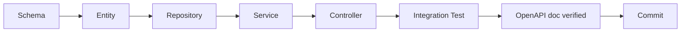

# ☕ Xuma Restaurant POS — Backend Implementation Plan

**Role:** Software Architect / Principal Engineer
**Document:** 3 of 5 — Backend (Phases 1–5)
**Stack:** Spring Boot 3.2+ · Java 21 · PostgreSQL 16 · Redis 7 · Flyway · MapStruct · Lombok

> **For the build agent:** Build phases in order. Do not start phase N+1 until phase N's "Definition of Done" is green. Every code example here is a *pattern*, not a copy-paste solution — extend it consistently. Architecture rules live in `code_architecture.md`.

---

## 0. Build Order, Test First, Ship Vertical Slices



Each feature follows the same path. Don't write five controllers then "circle back" for tests. A feature is *done* only after its integration test passes.

---

## PHASE 1 — Foundation & Infrastructure

**Goal:** A Spring Boot app that boots, connects to PG + Redis, runs Flyway migrations, exposes a health endpoint, returns the standard `ApiResponse` envelope, and runs under `docker compose up`.

### 1.1 Project Scaffold

Use Spring Initializr (`start.spring.io`) with **exactly** these dependencies:

```
spring-boot-starter-web
spring-boot-starter-data-jpa
spring-boot-starter-data-redis
spring-boot-starter-security
spring-boot-starter-validation
spring-boot-starter-actuator
spring-boot-starter-websocket
postgresql
flyway-core
flyway-database-postgresql
springdoc-openapi-starter-webmvc-ui   # 2.3+
lombok
mapstruct                              # 1.5.5+
jjwt-api / jjwt-impl / jjwt-jackson    # 0.12+
```

Java 21. Gradle Kotlin DSL preferred (`build.gradle.kts`), but Maven is acceptable.

### 1.2 Project Structure (Initial Commit)

Create the package skeleton from `code_architecture.md §2.1`. Empty packages are fine — they will fill up by phase.

### 1.3 `application.yml` (Profile-Aware)

```yaml
spring:
  application:
    name: xuma-pos
  profiles:
    active: ${SPRING_PROFILES_ACTIVE:dev}
  datasource:
    url: ${DB_URL:jdbc:postgresql://localhost:5432/xuma}
    username: ${DB_USER:xuma}
    password: ${DB_PASS:xuma}
    hikari:
      maximum-pool-size: 20
      minimum-idle: 5
  jpa:
    open-in-view: false                     # MUST be false
    hibernate:
      ddl-auto: validate                    # never 'update' in prod-likes
    properties:
      hibernate:
        format_sql: true
        jdbc.time_zone: UTC
  flyway:
    enabled: true
    baseline-on-migrate: true
    locations: classpath:db/migration
  data:
    redis:
      host: ${REDIS_HOST:localhost}
      port: ${REDIS_PORT:6379}
      timeout: 2s
  threads:
    virtual:
      enabled: true                          # Java 21 virtual threads

server:
  port: ${SERVER_PORT:8080}
  forward-headers-strategy: framework
  shutdown: graceful
  error:
    include-stacktrace: never

management:
  endpoints.web.exposure.include: health,info,metrics,prometheus
  endpoint.health.show-details: when-authorized

xuma:
  jwt:
    secret: ${JWT_SECRET:change-me-32+chars-please-change-in-prod}
    access-ttl-minutes: 15
    refresh-ttl-days: 7
  cors:
    allowed-origins: ${CORS_ORIGINS:http://localhost:3000}
  oauth:
    google:
      client-id: ${GOOGLE_CLIENT_ID:}
      client-secret: ${GOOGLE_CLIENT_SECRET:}
  stripe:
    secret-key: ${STRIPE_SECRET:}
    webhook-secret: ${STRIPE_WEBHOOK_SECRET:}

logging:
  pattern.console: "%d{HH:mm:ss.SSS} %-5level [%X{traceId:-},%X{spanId:-}] %logger{36} - %msg%n"
  level:
    com.xuma.pos: INFO
    org.springframework.security: INFO
```

### 1.4 Common Building Blocks

Create these in `common/` *before* any feature:

#### 1.4.1 `AuditableEntity`

```java
@MappedSuperclass
@EntityListeners(AuditingEntityListener.class)
@Getter
public abstract class AuditableEntity {
    @CreatedDate    @Column(updatable=false) Instant createdAt;
    @LastModifiedDate Instant updatedAt;
    @CreatedBy      @Column(updatable=false) String createdBy;
    @LastModifiedBy String updatedBy;
    @Version Long version;
}
```

`@EnableJpaAuditing` on a `JpaConfig` class. Provide an `AuditorAware<String>` bean that reads the principal name (or returns `"system"` for jobs).

#### 1.4.2 `SoftDeletableEntity`

```java
@MappedSuperclass @Getter
public abstract class SoftDeletableEntity extends AuditableEntity {
    Instant deletedAt;
    public boolean isDeleted() { return deletedAt != null; }
    public void softDelete() { this.deletedAt = Instant.now(); }
}
```

Use `@SQLDelete` and `@Where(clause="deleted_at IS NULL")` on entities that soft-delete (Order, MenuItem).

#### 1.4.3 `ApiResponse`, `ErrorResponse`, `PageResponse`

See `code_architecture.md §2.7`. Implement once, reuse forever.

#### 1.4.4 Exception Hierarchy

```java
public abstract class BusinessException extends RuntimeException {
    private final int status;
    protected BusinessException(String msg, int status) { super(msg); this.status = status; }
    public int getStatus() { return status; }
}
public class NotFoundException     extends BusinessException { public NotFoundException(String m){super(m,404);} }
public class ConflictException     extends BusinessException { public ConflictException(String m){super(m,409);} }
public class ForbiddenException    extends BusinessException { public ForbiddenException(String m){super(m,403);} }
public class ValidationException   extends BusinessException { public ValidationException(String m){super(m,400);} }
```

Domain-specific exceptions *extend* these: `OrderNotFoundException extends NotFoundException`, etc.

#### 1.4.5 `GlobalExceptionHandler`

Full implementation from `code_architecture.md §2.6`. Add handlers for:
- `MethodArgumentNotValidException` → 400 with field errors
- `ConstraintViolationException` → 400
- `DataIntegrityViolationException` → 409
- `BusinessException` (catches all subclasses)
- `AuthenticationException` → 401
- `AccessDeniedException` → 403
- `Exception` (catch-all) → 500, log as error

### 1.5 Database Bootstrap

**Migration: `V1_001__init_extensions.sql`**

```sql
CREATE EXTENSION IF NOT EXISTS pgcrypto;
CREATE EXTENSION IF NOT EXISTS citext;     -- case-insensitive email column
-- a Postgres function for updated_at safety net (Hibernate already handles it, but belt-and-braces)
```

**Migration naming convention:**
`V<phase>_<order>__<snake_case>.sql` — e.g. `V1_001__init_extensions.sql`, `V2_001__create_users.sql`, `V2_002__seed_roles.sql`. Never edit an applied migration; add a new one.

### 1.6 Health Check, Info & OpenAPI

- Actuator `/actuator/health` exposed to all (no auth) — needed by container orchestrators.
- Actuator `/actuator/info` exposes git commit (use `git-commit-id-maven-plugin` or gradle equivalent).
- SpringDoc at `/swagger-ui.html` and `/v3/api-docs`. Configure with API title, version, JWT security scheme.

### 1.7 Docker for Development

`docker-compose.dev.yml` provides PG + Redis:

```yaml
services:
  postgres:
    image: postgres:16-alpine
    environment:
      POSTGRES_DB: xuma
      POSTGRES_USER: xuma
      POSTGRES_PASSWORD: xuma
    ports: ["5432:5432"]
    volumes: ["pgdata:/var/lib/postgresql/data"]
    healthcheck:
      test: ["CMD-SHELL", "pg_isready -U xuma"]
      interval: 5s
  redis:
    image: redis:7-alpine
    command: redis-server --appendonly yes
    ports: ["6379:6379"]
    volumes: ["redisdata:/data"]
volumes:
  pgdata:
  redisdata:
```

The app itself runs locally during dev (faster reloads). Production compose is in `deployment.md`.

### 1.8 Phase 1 — Definition of Done

- [ ] `./gradlew bootRun` (or `mvn spring-boot:run`) starts on port 8080
- [ ] `GET /actuator/health` returns `{"status":"UP"}`
- [ ] `GET /v3/api-docs` returns a valid OpenAPI document
- [ ] Hitting an unknown endpoint returns the standard `ApiResponse` error envelope
- [ ] `docker compose -f docker-compose.dev.yml up -d` brings PG + Redis up; app connects on next start
- [ ] Flyway has run; `flyway_schema_history` table exists
- [ ] A trivial smoke test (`@SpringBootTest` that the context loads) passes in CI
- [ ] Lombok + MapStruct annotation processors verified (write one trivial mapper and one `@Data` POJO)

---

## PHASE 2 — Identity, Authentication & RBAC

**Goal:** Users can register, log in, refresh tokens, and use Google OAuth2. Roles and permissions exist in DB; `@PreAuthorize` enforces access on a protected demo endpoint. Refresh tokens rotate.

### 2.1 Migrations

**`V2_001__create_users.sql`**

```sql
CREATE TABLE users (
    id              BIGSERIAL PRIMARY KEY,
    email           CITEXT NOT NULL UNIQUE,
    password_hash   VARCHAR(255),                       -- nullable for OAuth-only users
    full_name       VARCHAR(120) NOT NULL,
    phone           VARCHAR(30),
    enabled         BOOLEAN NOT NULL DEFAULT TRUE,
    provider        VARCHAR(20) NOT NULL DEFAULT 'LOCAL',
    provider_id     VARCHAR(255),                       -- google sub
    created_at      TIMESTAMPTZ NOT NULL DEFAULT NOW(),
    updated_at      TIMESTAMPTZ NOT NULL DEFAULT NOW(),
    created_by      VARCHAR(120),
    updated_by      VARCHAR(120),
    version         BIGINT NOT NULL DEFAULT 0,
    UNIQUE (provider, provider_id)
);
CREATE INDEX idx_users_email ON users (email);
```

**`V2_002__create_roles_permissions.sql`**

```sql
CREATE TABLE roles (
    id BIGSERIAL PRIMARY KEY,
    name VARCHAR(40) NOT NULL UNIQUE,           -- SUPER_ADMIN, ADMIN, MANAGER, CASHIER, WAITER, KITCHEN_STAFF, CUSTOMER
    description VARCHAR(255)
);
CREATE TABLE permissions (
    id BIGSERIAL PRIMARY KEY,
    name VARCHAR(80) NOT NULL UNIQUE,           -- 'menu:read', 'menu:write', 'order:create', ...
    description VARCHAR(255)
);
CREATE TABLE user_roles (
    user_id BIGINT REFERENCES users(id) ON DELETE CASCADE,
    role_id BIGINT REFERENCES roles(id) ON DELETE CASCADE,
    PRIMARY KEY (user_id, role_id)
);
CREATE TABLE role_permissions (
    role_id BIGINT REFERENCES roles(id) ON DELETE CASCADE,
    permission_id BIGINT REFERENCES permissions(id) ON DELETE CASCADE,
    PRIMARY KEY (role_id, permission_id)
);
```

**`V2_003__seed_roles_permissions.sql`** — seed all seven roles and the full permission matrix from `01_system_design.md §4.2`. Idempotent (`INSERT ... ON CONFLICT DO NOTHING`).

**`V2_004__create_refresh_tokens.sql`**

```sql
CREATE TABLE refresh_tokens (
    id              BIGSERIAL PRIMARY KEY,
    token_hash      VARCHAR(255) NOT NULL UNIQUE,        -- store SHA-256 hash, never the raw token
    user_id         BIGINT NOT NULL REFERENCES users(id) ON DELETE CASCADE,
    family_id       UUID NOT NULL,                       -- rotation family
    issued_at       TIMESTAMPTZ NOT NULL DEFAULT NOW(),
    expires_at      TIMESTAMPTZ NOT NULL,
    revoked         BOOLEAN NOT NULL DEFAULT FALSE,
    user_agent      VARCHAR(255),
    ip              VARCHAR(45)
);
CREATE INDEX idx_refresh_user ON refresh_tokens(user_id);
CREATE INDEX idx_refresh_family ON refresh_tokens(family_id);
```

### 2.2 Domain Entities

```java
@Entity @Table(name="users")
@Getter @Setter @NoArgsConstructor @AllArgsConstructor @Builder
public class User extends AuditableEntity {
    @Id @GeneratedValue(strategy = GenerationType.IDENTITY) Long id;
    @Column(nullable=false, unique=true) String email;
    String passwordHash;
    @Column(nullable=false) String fullName;
    String phone;
    @Column(nullable=false) boolean enabled = true;
    @Enumerated(EnumType.STRING) @Column(nullable=false) AuthProvider provider = AuthProvider.LOCAL;
    String providerId;

    @ManyToMany(fetch=FetchType.EAGER)
    @JoinTable(name="user_roles",
        joinColumns=@JoinColumn(name="user_id"),
        inverseJoinColumns=@JoinColumn(name="role_id"))
    @Builder.Default Set<Role> roles = new HashSet<>();

    public Set<String> permissionNames() {
        return roles.stream()
            .flatMap(r -> r.getPermissions().stream())
            .map(Permission::getName)
            .collect(Collectors.toUnmodifiableSet());
    }
}
```

Similar for `Role`, `Permission`, `RefreshToken`. Use Lombok wisely: `@Getter`, `@Setter` only where mutation is legitimate; `@NoArgsConstructor(access=AccessLevel.PROTECTED)` on entities (JPA requirement, but discourages misuse).

### 2.3 Security Configuration

```java
@Configuration
@EnableWebSecurity
@EnableMethodSecurity                       // enables @PreAuthorize
@RequiredArgsConstructor
public class SecurityConfig {
    private final JwtAuthFilter jwtAuthFilter;
    private final JwtAuthEntryPoint entryPoint;

    @Bean PasswordEncoder passwordEncoder() { return new BCryptPasswordEncoder(12); }

    @Bean SecurityFilterChain api(HttpSecurity http) throws Exception {
        return http
            .csrf(AbstractHttpConfigurer::disable)             // stateless JWT
            .cors(Customizer.withDefaults())
            .sessionManagement(s -> s.sessionCreationPolicy(SessionCreationPolicy.STATELESS))
            .authorizeHttpRequests(auth -> auth
                .requestMatchers("/actuator/health", "/v3/api-docs/**", "/swagger-ui/**").permitAll()
                .requestMatchers("/api/auth/**").permitAll()
                .requestMatchers("/api/menu/**").permitAll()       // public reads in phase 3
                .requestMatchers("/ws/**").permitAll()             // WS handshake; auth via token
                .anyRequest().authenticated())
            .exceptionHandling(e -> e.authenticationEntryPoint(entryPoint))
            .addFilterBefore(jwtAuthFilter, UsernamePasswordAuthenticationFilter.class)
            .build();
    }
}
```

### 2.4 JWT Implementation

`JwtService` (encode/decode/validate). Claims: `sub` (userId), `email`, `roles`, `permissions`, `iat`, `exp`, `jti`. Access token TTL 15min, refresh 7 days. **Never sign with `none`.** HS256 minimum; HS512 acceptable.

`JwtAuthFilter` (one-per-request): reads `Authorization: Bearer ...` *or* HttpOnly cookie `xuma_at`, validates, builds `UserPrincipal`, sets `SecurityContextHolder`. On invalid token, do not throw — leave context empty; the entry point handles 401.

```java
@Component @RequiredArgsConstructor
public class JwtAuthFilter extends OncePerRequestFilter {
    private final JwtService jwt;
    private final UserRepository users;

    @Override
    protected void doFilterInternal(HttpServletRequest req, HttpServletResponse res, FilterChain chain)
            throws ServletException, IOException {
        String token = extractToken(req);
        if (token != null) {
            try {
                Claims c = jwt.parse(token);
                User u = users.findById(c.get("sub", Long.class)).orElse(null);
                if (u != null && u.isEnabled()) {
                    UserPrincipal p = UserPrincipal.from(u);
                    var auth = new UsernamePasswordAuthenticationToken(p, null, p.getAuthorities());
                    auth.setDetails(new WebAuthenticationDetailsSource().buildDetails(req));
                    SecurityContextHolder.getContext().setAuthentication(auth);
                }
            } catch (JwtException ignored) { /* leave unauthenticated */ }
        }
        chain.doFilter(req, res);
    }
    private String extractToken(HttpServletRequest req) {
        String h = req.getHeader("Authorization");
        if (h != null && h.startsWith("Bearer ")) return h.substring(7);
        if (req.getCookies() != null) {
            for (Cookie c : req.getCookies()) if ("xuma_at".equals(c.getName())) return c.getValue();
        }
        return null;
    }
}
```

`UserPrincipal` implements `UserDetails`. Its authorities = permissions (e.g. `menu:write`), not role names. This is *the* important RBAC decision: code authorizes on permissions, roles are just bundles.

### 2.5 Auth Endpoints

| Method | Path | Body | Auth | Returns |
|---|---|---|---|---|
| POST | `/api/auth/register` | `RegisterRequest` | public | `TokenResponse` |
| POST | `/api/auth/login` | `LoginRequest` | public | `TokenResponse` |
| POST | `/api/auth/refresh` | `RefreshRequest` | public (cookie or body) | `TokenResponse` |
| POST | `/api/auth/logout` | — | auth | 204 |
| POST | `/api/auth/oauth/google` | `OAuthCallbackRequest` (code, redirect_uri) | public | `TokenResponse` |
| GET | `/api/auth/me` | — | auth | `UserResponse` |

Set tokens as HttpOnly cookies *and* return them in the body — frontend chooses how to use them (cookies for browser, body for mobile).

### 2.6 Refresh Token Rotation (Critical Security)

Every refresh issues a *new* access and refresh token. The presented refresh token is marked `revoked = true`. The new token belongs to the same `family_id`. **If a revoked refresh token is presented again** → token theft suspected → revoke the entire family → force re-login. This is OAuth 2.0 refresh-token-rotation done right.

```java
@Transactional
public TokenResponse refresh(String presentedToken) {
    RefreshToken existing = refreshRepo.findByTokenHash(sha256(presentedToken))
        .orElseThrow(() -> new UnauthorizedException("Invalid refresh token"));
    if (existing.isRevoked()) {
        refreshRepo.revokeFamily(existing.getFamilyId());     // reuse detected — kill family
        throw new UnauthorizedException("Refresh token reuse detected");
    }
    if (existing.getExpiresAt().isBefore(Instant.now())) {
        throw new UnauthorizedException("Refresh token expired");
    }
    existing.setRevoked(true);
    User user = userRepo.getById(existing.getUserId());
    return issueTokens(user, existing.getFamilyId());
}
```

### 2.7 Google OAuth (No Keycloak)

`GoogleOAuthService` exchanges the authorization code for Google's user-info (email, name, `sub`). Then:
- If a user exists with the same email + provider `GOOGLE` → log them in.
- If a user exists with the same email + provider `LOCAL` → **link** the Google identity (set `provider_id`, keep `LOCAL` as primary or upgrade — pick one rule and document it).
- Otherwise create a fresh `CUSTOMER` user.

Use Spring's `RestClient` (not legacy `RestTemplate`). Never store the Google access token long-term; we only need profile data once.

### 2.8 Rate Limiting on Auth

Sliding-window counter in Redis keyed by IP: `ratelimit:login:<ip>`. 5 attempts per 15 minutes. Use Bucket4j with Redis backend, or implement a simple Lua script:

```lua
-- INCR a key; set EXPIRE on first increment
local v = redis.call("INCR", KEYS[1])
if v == 1 then redis.call("EXPIRE", KEYS[1], ARGV[1]) end
return v
```

A `RateLimitFilter` (placed before `JwtAuthFilter` for `/api/auth/**`) returns `429 Too Many Requests` when exceeded.

### 2.9 Permission Seeding

Use a `@ConfigurationProperties` class (`PermissionsProperties`) plus a `CommandLineRunner` that reads a YAML file (`config/permissions.yml`) describing the full matrix from `01_system_design.md §4.2` and reconciles roles ↔ permissions on every boot (additive only — never silently delete production permissions).

### 2.10 Demo Endpoint (Verify Authorization Works)

```java
@RestController @RequestMapping("/api/admin")
public class AdminPingController {
    @GetMapping("/ping")
    @PreAuthorize("hasAuthority('system:config')")
    public ApiResponse<String> ping() { return ApiResponse.ok("pong from admin"); }
}
```

Hit it as a `CUSTOMER` → 403. As `SUPER_ADMIN` → 200.

### 2.11 Tests (Phase 2)

- `JwtServiceTest` — token round-trip, expiry, tampering rejection
- `OrderStateMachineTest` placeholder (will fill in phase 4)
- `AuthControllerIT` (Testcontainers) — register → login → /me → refresh → reuse old refresh → 401 + family revoked
- `SecurityConfigIT` — public path open, protected path 401 without token, 403 with wrong role

### 2.12 Phase 2 — Definition of Done

- [ ] User can register and log in; receives JWT in cookie + body
- [ ] Refresh rotation works and reuse triggers family revocation
- [ ] Google OAuth login works against a real (dev) Google app
- [ ] `@PreAuthorize` blocks unauthorized callers (verified in tests)
- [ ] Rate limit triggers `429` after 5 failed logins from same IP
- [ ] No passwords or tokens ever appear in logs (verified by grep through test logs)
- [ ] `/api/auth/me` returns the authenticated user's profile and roles

---

## PHASE 3 — Menu & Catalog

**Goal:** Public can read the full menu (cached). Admins can CRUD categories, items, allergens. Image URLs are stored (S3/Cloudinary integration is out of scope — accept any URL). Cache evicts on writes.

### 3.1 Migrations

**`V3_001__create_categories.sql`**

```sql
CREATE TABLE categories (
    id BIGSERIAL PRIMARY KEY,
    name VARCHAR(80) NOT NULL,
    icon VARCHAR(40),
    sort_order INT NOT NULL DEFAULT 0,
    active BOOLEAN NOT NULL DEFAULT TRUE,
    created_at TIMESTAMPTZ NOT NULL DEFAULT NOW(),
    updated_at TIMESTAMPTZ NOT NULL DEFAULT NOW(),
    created_by VARCHAR(120),
    updated_by VARCHAR(120),
    version BIGINT NOT NULL DEFAULT 0
);
```

**`V3_002__create_menu_items.sql`**

```sql
CREATE TABLE allergens (
    id BIGSERIAL PRIMARY KEY,
    name VARCHAR(40) NOT NULL UNIQUE
);
CREATE TABLE menu_items (
    id BIGSERIAL PRIMARY KEY,
    category_id BIGINT NOT NULL REFERENCES categories(id),
    name VARCHAR(120) NOT NULL,
    description TEXT,
    price NUMERIC(10,2) NOT NULL CHECK (price >= 0),
    image_url VARCHAR(500),
    available BOOLEAN NOT NULL DEFAULT TRUE,
    featured  BOOLEAN NOT NULL DEFAULT FALSE,
    prep_time_minutes INT NOT NULL DEFAULT 15 CHECK (prep_time_minutes >= 0),
    calories INT CHECK (calories IS NULL OR calories >= 0),
    deleted_at TIMESTAMPTZ,
    created_at TIMESTAMPTZ NOT NULL DEFAULT NOW(),
    updated_at TIMESTAMPTZ NOT NULL DEFAULT NOW(),
    created_by VARCHAR(120),
    updated_by VARCHAR(120),
    version BIGINT NOT NULL DEFAULT 0
);
CREATE INDEX idx_menu_items_category ON menu_items(category_id) WHERE deleted_at IS NULL;
CREATE INDEX idx_menu_items_featured ON menu_items(featured) WHERE featured = TRUE AND deleted_at IS NULL;

CREATE TABLE menu_item_allergens (
    menu_item_id BIGINT REFERENCES menu_items(id) ON DELETE CASCADE,
    allergen_id  BIGINT REFERENCES allergens(id)  ON DELETE CASCADE,
    PRIMARY KEY (menu_item_id, allergen_id)
);
```

**`V3_003__seed_allergens.sql`** — gluten, dairy, eggs, peanuts, tree nuts, soy, fish, shellfish, sesame, mustard, celery, lupin, sulphites, molluscs (EU 14).

### 3.2 Entities

`Category`, `MenuItem`, `Allergen` — straightforward. `MenuItem extends SoftDeletableEntity`. Use lazy fetch for the category relation (`@ManyToOne(fetch=LAZY)`). Allergens via `@ManyToMany(fetch=EAGER)` since they're tiny and always needed.

Rich behavior on `MenuItem`:

```java
public void make86() { this.available = false; }
public void restock() { this.available = true; }
public void updatePrice(BigDecimal newPrice) {
    if (newPrice == null || newPrice.signum() < 0) throw new ValidationException("Price must be >= 0");
    this.price = newPrice.setScale(2, RoundingMode.HALF_UP);
}
```

### 3.3 Endpoints

| Method | Path | Auth | Purpose |
|---|---|---|---|
| GET | `/api/menu` | public | Full menu, grouped by category, only `available=true` |
| GET | `/api/menu/categories` | public | All active categories |
| GET | `/api/menu/items/{id}` | public | One item |
| GET | `/api/menu/featured` | public | Featured items |
| GET | `/api/admin/menu/items` | `menu:write` | All items, paginated, includes unavailable + soft-deleted |
| POST | `/api/admin/menu/items` | `menu:write` | Create |
| PUT | `/api/admin/menu/items/{id}` | `menu:write` | Update |
| PATCH | `/api/admin/menu/items/{id}/availability` | `menu:write` | Toggle `available` |
| DELETE | `/api/admin/menu/items/{id}` | `menu:write` | Soft delete |
| (similar for categories & allergens) | | | |

### 3.4 Caching with Redis

`MenuCacheService` is the *only* place that touches Redis for menu. Service depends on it, not on `RedisTemplate` directly.

```java
@Service @RequiredArgsConstructor
public class MenuCacheService {
    private static final String KEY_FULL     = "menu:full";
    private static final String KEY_FEATURED = "menu:featured";
    private static final Duration TTL = Duration.ofMinutes(10);
    private final StringRedisTemplate redis;
    private final ObjectMapper json;

    public Optional<List<CategoryResponse>> getFullMenu() { return read(KEY_FULL, new TypeReference<>(){}); }
    public void putFullMenu(List<CategoryResponse> data) { write(KEY_FULL, data); }
    public Optional<List<MenuItemResponse>> getFeatured() { return read(KEY_FEATURED, new TypeReference<>(){}); }
    public void putFeatured(List<MenuItemResponse> data) { write(KEY_FEATURED, data); }
    public void evictAll() { redis.delete(List.of(KEY_FULL, KEY_FEATURED)); }

    private <T> Optional<T> read(String key, TypeReference<T> type) { /* try-get-parse */ }
    private void write(String key, Object data) { /* serialize-set-expire */ }
}
```

`MenuServiceImpl.getFullMenu()`: try cache → on miss, query DB → write cache → return. Any write (create/update/delete/86) calls `cache.evictAll()`. Avoid `@Cacheable` annotations for this — they're convenient but hide complexity; explicit is better here.

### 3.5 Mapping (MapStruct)

```java
@Mapper(componentModel="spring", uses=AllergenMapper.class)
public interface MenuItemMapper {
    MenuItemResponse toResponse(MenuItem item);
    @Mapping(target="id", ignore=true)
    @Mapping(target="category", ignore=true)        // looked up by id in service
    @Mapping(target="allergens", ignore=true)
    MenuItem toEntity(CreateMenuItemRequest req);
    void update(@MappingTarget MenuItem entity, UpdateMenuItemRequest req);
}
```

### 3.6 Tests (Phase 3)

- `MenuServiceTest` — cache hit, cache miss → DB → cache populated, eviction on write
- `MenuApiIT` — full CRUD as admin, public read returns only available items, 403 for `menu:write` on non-admins
- `MenuCacheServiceIT` — round trip with Testcontainers Redis

### 3.7 Phase 3 — Definition of Done

- [ ] Public can `GET /api/menu` without auth; response cached
- [ ] Admin can create/update/86 items; cache evicts
- [ ] Soft-deleted items don't appear in public listing
- [ ] Image URLs validated (`@URL`) on create/update
- [ ] Price guarded: never negative, always scale 2
- [ ] Pagination on `/api/admin/menu/items` (`?page=0&size=20&sort=name,asc`)
- [ ] Categories ordered by `sort_order` then `name`

---

## PHASE 4 — Orders & Real-Time

**Goal:** Orders can be created, transitioned through their state machine, and cancelled. All state changes broadcast over STOMP. Idempotency on create prevents duplicate orders from accidental retries.

### 4.1 Migrations

**`V4_001__create_orders.sql`**

```sql
CREATE TABLE orders (
    id BIGSERIAL PRIMARY KEY,
    order_number      VARCHAR(30) NOT NULL UNIQUE,
    type              VARCHAR(20) NOT NULL,                -- DINE_IN, TAKEAWAY, DELIVERY
    status            VARCHAR(20) NOT NULL DEFAULT 'PENDING',
    subtotal          NUMERIC(10,2) NOT NULL DEFAULT 0,
    tax               NUMERIC(10,2) NOT NULL DEFAULT 0,
    discount          NUMERIC(10,2) NOT NULL DEFAULT 0,
    total             NUMERIC(10,2) NOT NULL DEFAULT 0,
    customer_note     VARCHAR(500),
    table_id          BIGINT,                              -- FK added in phase 5
    assigned_waiter_id BIGINT REFERENCES users(id),
    customer_id       BIGINT REFERENCES users(id),
    idempotency_key   VARCHAR(80) UNIQUE,
    deleted_at        TIMESTAMPTZ,
    created_at        TIMESTAMPTZ NOT NULL DEFAULT NOW(),
    updated_at        TIMESTAMPTZ NOT NULL DEFAULT NOW(),
    created_by VARCHAR(120), updated_by VARCHAR(120),
    version BIGINT NOT NULL DEFAULT 0
);
CREATE INDEX idx_orders_status ON orders(status) WHERE deleted_at IS NULL;
CREATE INDEX idx_orders_created ON orders(created_at DESC) WHERE deleted_at IS NULL;

CREATE TABLE order_items (
    id BIGSERIAL PRIMARY KEY,
    order_id      BIGINT NOT NULL REFERENCES orders(id) ON DELETE CASCADE,
    menu_item_id  BIGINT NOT NULL REFERENCES menu_items(id),
    quantity      INT NOT NULL CHECK (quantity > 0),
    unit_price    NUMERIC(10,2) NOT NULL CHECK (unit_price >= 0),
    special_request VARCHAR(200),
    status        VARCHAR(20) NOT NULL DEFAULT 'PENDING',
    created_at    TIMESTAMPTZ NOT NULL DEFAULT NOW(),
    updated_at    TIMESTAMPTZ NOT NULL DEFAULT NOW()
);
CREATE INDEX idx_order_items_order ON order_items(order_id);
```

### 4.2 Enums

`OrderStatus { PENDING, PREPARING, READY, SERVED, PAID, CANCELLED }`
`OrderItemStatus { PENDING, PREPARING, READY }`
`OrderType { DINE_IN, TAKEAWAY, DELIVERY }`

### 4.3 The State Machine

```java
public final class OrderStateMachine {
    private static final Map<OrderStatus, Set<OrderStatus>> ALLOWED = Map.of(
        PENDING,    Set.of(PREPARING, CANCELLED),
        PREPARING,  Set.of(READY, CANCELLED),
        READY,      Set.of(SERVED),
        SERVED,     Set.of(PAID),
        PAID,       Set.of(),
        CANCELLED,  Set.of()
    );
    private OrderStateMachine() {}
    public static boolean canTransition(OrderStatus from, OrderStatus to) {
        return ALLOWED.getOrDefault(from, Set.of()).contains(to);
    }
    public static void validate(OrderStatus from, OrderStatus to) {
        if (!canTransition(from, to)) {
            throw new InvalidOrderStateException(
                "Illegal transition: %s → %s".formatted(from, to));
        }
    }
}
```

100% covered by a table-driven unit test that asserts every (from, to) pair against the documented graph.

### 4.4 Rich `Order` Aggregate

```java
@Entity @Table(name="orders") @Getter
@NoArgsConstructor(access=AccessLevel.PROTECTED)
public class Order extends SoftDeletableEntity {
    @Id @GeneratedValue Long id;
    @Column(nullable=false, unique=true) String orderNumber;
    @Enumerated(EnumType.STRING) OrderType type;
    @Enumerated(EnumType.STRING) OrderStatus status = OrderStatus.PENDING;
    @Setter BigDecimal subtotal = ZERO, tax = ZERO, discount = ZERO, total = ZERO;
    String customerNote;
    Long tableId;
    Long assignedWaiterId;
    Long customerId;
    @Column(unique=true) String idempotencyKey;

    @OneToMany(mappedBy="order", cascade=ALL, orphanRemoval=true)
    private final List<OrderItem> items = new ArrayList<>();

    public static Order open(OrderType type, Long tableId, Long customerId, Long waiterId,
                             String orderNumber, String idempotencyKey) {
        Order o = new Order();
        o.type = type; o.tableId = tableId; o.customerId = customerId;
        o.assignedWaiterId = waiterId;
        o.orderNumber = orderNumber;
        o.idempotencyKey = idempotencyKey;
        return o;
    }

    public OrderItem addItem(MenuItem menuItem, int quantity, String note) {
        if (status != OrderStatus.PENDING)
            throw new InvalidOrderStateException("Cannot modify a " + status + " order");
        if (!menuItem.isAvailable())
            throw new ValidationException("Item not available: " + menuItem.getName());
        OrderItem oi = OrderItem.of(this, menuItem, quantity, note);
        items.add(oi);
        recalculate();
        return oi;
    }

    public void transitionTo(OrderStatus next) {
        OrderStateMachine.validate(this.status, next);
        this.status = next;
    }

    public void applyDiscount(BigDecimal amount) {
        if (amount.signum() < 0 || amount.compareTo(subtotal) > 0)
            throw new ValidationException("Discount out of range");
        this.discount = amount.setScale(2, HALF_UP);
        recalculate();
    }

    void recalculate() {
        this.subtotal = items.stream().map(OrderItem::lineTotal).reduce(ZERO, BigDecimal::add);
        this.tax = MoneyUtil.tax(subtotal);                          // 21% NL VAT, or 9% for food — config-driven
        this.total = subtotal.add(tax).subtract(discount).setScale(2, HALF_UP);
    }
}
```

### 4.5 Order Number Generator

`ORD-yyyyMMdd-####` with a per-day sequence. Use a Postgres sequence per day, or a `daily_order_sequences` table. Cheap option: optimistic — try `INSERT ... ON CONFLICT (date) DO UPDATE SET seq = seq + 1 RETURNING seq`.

### 4.6 Idempotency

Clients send `Idempotency-Key` header on create. Service:
1. Look up by `idempotency_key` — if found, return that order (200, not a re-create).
2. Otherwise create with the key; the unique index protects against a race.

### 4.7 Endpoints

| Method | Path | Auth | Purpose |
|---|---|---|---|
| POST | `/api/orders` | `order:create` | Create (with `Idempotency-Key` header) |
| GET | `/api/orders/{id}` | `order:create` (own) or `order:update_status` | Read |
| GET | `/api/orders/active` | `order:update_status` | Kitchen + waiter live queue |
| GET | `/api/orders` | `report:view` | Paged historical |
| PATCH | `/api/orders/{id}/status` | `order:update_status` | Transition |
| PATCH | `/api/orders/{id}/items/{itemId}/status` | `order:update_status` | Per-item ready/pending |
| POST | `/api/orders/{id}/cancel` | `order:cancel` | Soft cancel |
| GET | `/api/orders/mine` | authenticated `CUSTOMER` | Customer's history |

### 4.8 WebSocket / STOMP

**Config:**

```java
@Configuration @EnableWebSocketMessageBroker @RequiredArgsConstructor
public class WebSocketConfig implements WebSocketMessageBrokerConfigurer {
    private final WebSocketAuthInterceptor authInterceptor;
    @Override public void registerStompEndpoints(StompEndpointRegistry r) {
        r.addEndpoint("/ws").setAllowedOriginPatterns("*").withSockJS();
    }
    @Override public void configureMessageBroker(MessageBrokerRegistry r) {
        r.enableSimpleBroker("/topic");
        r.setApplicationDestinationPrefixes("/app");
    }
    @Override public void configureClientInboundChannel(ChannelRegistration r) {
        r.interceptors(authInterceptor);                  // validates JWT on CONNECT
    }
}
```

**Topics:**

| Topic | Payload | Audience |
|---|---|---|
| `/topic/orders/new` | full `OrderResponse` | Kitchen (KDS) |
| `/topic/orders/{orderId}/status` | `{status, updatedAt}` | Waiter, Customer |
| `/topic/orders/{orderId}/items/{itemId}` | `{status}` | Waiter |
| `/topic/tables/status` | `{tableId, status}` | All staff (phase 5) |
| `/topic/kitchen/queue` | summary | KDS |

**Publisher:**

```java
@Component @RequiredArgsConstructor
public class OrderEventPublisher {
    private final ApplicationEventPublisher events;
    public void published(OrderCreatedEvent e) { events.publishEvent(e); }
    // ...
}

@Component @RequiredArgsConstructor
public class OrderEventBroadcaster {
    private final SimpMessagingTemplate ws;
    private final OrderMapper mapper;

    @EventListener @Async
    public void onCreated(OrderCreatedEvent e) {
        ws.convertAndSend("/topic/orders/new", mapper.toResponse(e.order()));
    }
    @EventListener @Async
    public void onStatusChanged(OrderStatusChangedEvent e) {
        ws.convertAndSend("/topic/orders/" + e.orderId() + "/status",
            Map.of("status", e.status(), "updatedAt", e.at()));
    }
}
```

Service emits events *after commit* with `@TransactionalEventListener(phase = AFTER_COMMIT)` — never broadcast a row that might rollback.

### 4.9 Tests (Phase 4)

- `OrderStateMachineTest` — exhaustive matrix
- `OrderServiceTest` — happy path, idempotent retry returns same order, item add fails when status != PENDING, discount edge cases
- `OrderApiIT` — full flow create → preparing → ready → served → paid; cancel flow; idempotency under concurrent submit
- `OrderWsIT` — STOMP client subscribes, performs an HTTP create, asserts message arrives on `/topic/orders/new`

### 4.10 Phase 4 — Definition of Done

- [ ] Order create with idempotency key returns the same order on retry
- [ ] State machine rejects every illegal transition (tested exhaustively)
- [ ] WS broadcasts arrive within 100ms of HTTP response
- [ ] Soft cancel works; cancelled orders excluded from active queue
- [ ] Customer can read only their own orders; staff can read assigned
- [ ] All money math goes through `MoneyUtil` (no inline `.scale(2)`)
- [ ] Order number is unique per day, never colliding under load

---

## PHASE 5 — Tables, Payments, Reports & Hardening

**Goal:** Floor management (tables + reservations), payment processing (Stripe + cash + split), receipts, reporting aggregates, and full security hardening for production.

### 5.1 Tables & Reservations

**Migrations:**

```sql
CREATE TABLE restaurant_tables (
    id BIGSERIAL PRIMARY KEY,
    table_number VARCHAR(20) NOT NULL UNIQUE,
    capacity INT NOT NULL CHECK (capacity > 0),
    section VARCHAR(20) NOT NULL,                 -- INDOOR, OUTDOOR, BAR, PRIVATE
    status VARCHAR(20) NOT NULL DEFAULT 'AVAILABLE',
    current_order_id BIGINT REFERENCES orders(id),
    created_at TIMESTAMPTZ NOT NULL DEFAULT NOW(),
    updated_at TIMESTAMPTZ NOT NULL DEFAULT NOW(),
    version BIGINT NOT NULL DEFAULT 0
);
ALTER TABLE orders ADD CONSTRAINT fk_orders_table FOREIGN KEY (table_id) REFERENCES restaurant_tables(id);

CREATE TABLE reservations (
    id BIGSERIAL PRIMARY KEY,
    customer_id BIGINT NOT NULL REFERENCES users(id),
    table_id BIGINT REFERENCES restaurant_tables(id),
    reservation_time TIMESTAMPTZ NOT NULL,
    party_size INT NOT NULL CHECK (party_size > 0),
    status VARCHAR(20) NOT NULL DEFAULT 'PENDING',
    notes VARCHAR(500),
    created_at TIMESTAMPTZ NOT NULL DEFAULT NOW(),
    updated_at TIMESTAMPTZ NOT NULL DEFAULT NOW(),
    version BIGINT NOT NULL DEFAULT 0
);
CREATE INDEX idx_reservation_time ON reservations(reservation_time);
```

Endpoints:

| Method | Path | Auth | Purpose |
|---|---|---|---|
| GET | `/api/tables` | `table:manage` | Live status of all tables |
| PATCH | `/api/tables/{id}/status` | `table:manage` | AVAILABLE/OCCUPIED/RESERVED/CLEANING |
| POST | `/api/reservations` | public (with rate limit) | Create reservation |
| GET | `/api/reservations` | `table:manage` | Today's bookings |
| PATCH | `/api/reservations/{id}/status` | `table:manage` | CONFIRMED, SEATED, NO_SHOW, CANCELLED |

Table status changes broadcast to `/topic/tables/status`. When an order moves to `PAID`, its table → `AVAILABLE`.

### 5.2 Payments — Strategy Pattern

```java
public interface PaymentStrategy {
    PaymentMethod method();
    Payment process(Order order, ProcessPaymentRequest req);
}

@Component
public class CashPaymentStrategy implements PaymentStrategy {
    public PaymentMethod method() { return PaymentMethod.CASH; }
    public Payment process(Order order, ProcessPaymentRequest req) {
        return Payment.successful(order, PaymentMethod.CASH, req.amount(), null);
    }
}

@Component @RequiredArgsConstructor
public class CardPaymentStrategy implements PaymentStrategy {
    private final StripeService stripe;
    public PaymentMethod method() { return PaymentMethod.CARD; }
    public Payment process(Order order, ProcessPaymentRequest req) {
        PaymentIntent pi = stripe.confirmPaymentIntent(req.paymentIntentId(), order.getTotal());
        return Payment.successful(order, PaymentMethod.CARD, req.amount(), pi.getId());
    }
}

@Service @RequiredArgsConstructor
public class PaymentServiceImpl implements PaymentService {
    private final List<PaymentStrategy> strategies;
    private final Map<PaymentMethod, PaymentStrategy> registry = new EnumMap<>(PaymentMethod.class);
    private final OrderRepository orderRepo;
    private final PaymentRepository paymentRepo;
    private final ReceiptService receipts;

    @PostConstruct void index() { strategies.forEach(s -> registry.put(s.method(), s)); }

    @Transactional
    public PaymentResponse settle(Long orderId, ProcessPaymentRequest req) {
        Order order = orderRepo.findById(orderId)
            .orElseThrow(() -> new OrderNotFoundException(orderId));
        if (order.getStatus() != OrderStatus.SERVED)
            throw new InvalidOrderStateException("Order must be SERVED to be settled");
        PaymentStrategy s = registry.get(req.method());
        if (s == null) throw new ValidationException("Unsupported method: " + req.method());

        Payment payment = s.process(order, req);
        paymentRepo.save(payment);
        order.transitionTo(OrderStatus.PAID);
        receipts.generate(payment);
        return mapper.toResponse(payment);
    }
}
```

### 5.3 Stripe Integration

`StripeService` wraps the Stripe SDK. Three responsibilities:
- Create `PaymentIntent` for an order amount → returns client secret.
- Confirm `PaymentIntent` (server-side reconciliation).
- Verify webhook signature.

**Webhook controller:** `POST /api/stripe/webhook` — public endpoint with signature verification (do not authorize with JWT; Stripe authorizes via signed payload). Persist every received event id in a `stripe_events` table to ensure idempotency.

### 5.4 Receipts

`Receipt` entity stores `receipt_number`, `pdf_url`, `issued_at`, `payment_id`. PDF generation via a small library (e.g. `OpenPDF` or `Apache PDFBox`). Store PDFs in `/var/xuma/receipts/{yyyy}/{MM}/{receiptNumber}.pdf` for v1; S3 later.

Email receipt is fire-and-forget via Spring `JavaMailSender` (SMTP config in `application.yml`). Failure to email does not roll back the payment.

### 5.5 Reports

Read-only projection records, never entities:

```java
public record DailyRevenueRow(LocalDate date, BigDecimal revenue, long orderCount, BigDecimal avgTicket) {}
public record TopItemRow(Long itemId, String name, long sold, BigDecimal revenue) {}
public record HourlyHeatmapCell(int dayOfWeek, int hour, long orderCount) {}
```

Endpoints:

| Method | Path | Auth | Purpose |
|---|---|---|---|
| GET | `/api/reports/revenue?from=&to=` | `report:view` | Daily revenue rows |
| GET | `/api/reports/top-items?from=&to=&limit=10` | `report:view` | Best sellers |
| GET | `/api/reports/heatmap` | `report:view` | Day×hour order volume |
| GET | `/api/reports/staff?from=&to=` | `report:view` | Orders per waiter |

Use native queries (`@Query(nativeQuery=true)`) for aggregations — JPQL gets clunky with `GROUP BY` and date functions. Index on `orders.created_at` (already created in phase 4).

### 5.6 Security Hardening

Final pass; verify each item with a test or manual check:

```
□ BCrypt strength 12 (already)
□ JWT secret loaded from env, fails fast on startup if shorter than 32 bytes
□ Access token 15min, refresh 7d (already)
□ Refresh rotation + reuse detection (already)
□ HTTPS-only cookies in prod profile (Secure, HttpOnly, SameSite=Strict)
□ CORS allowed-origins explicit (no wildcards in prod)
□ Rate limit on /api/auth/** (already)
□ Rate limit on /api/reservations (public, abusable)
□ Input validation on every DTO
□ All controllers either @PreAuthorize or explicitly @PermitAll-documented
□ Logging: filter masks email + token patterns
□ Stripe webhook signature verified
□ SQL: only JPQL + parameter binding (no string concat)
□ Disable Actuator endpoints other than health in prod
□ /v3/api-docs and /swagger-ui blocked in prod profile
□ Spring Security headers: X-Content-Type-Options nosniff, Referrer-Policy strict-origin-when-cross-origin,
  Permissions-Policy restrictive
□ Dependency scan: ./gradlew dependencyCheckAnalyze (OWASP) — no high CVEs
```

### 5.7 Observability

- **Logs:** Logback JSON encoder in prod. Each log has `traceId`, `spanId`, `userId` (when authenticated).
- **Metrics:** Micrometer + Prometheus registry. Custom counters: `orders_created_total`, `orders_cancelled_total`, `payment_failures_total{method}`.
- **Tracing:** Micrometer Tracing + OpenTelemetry exporter (optional in v1).
- **Health groups:** `liveness` (app up) vs `readiness` (PG + Redis reachable).

### 5.8 Tests (Phase 5)

- `PaymentServiceTest` — strategy dispatch, illegal state when order not SERVED, Stripe failure rolls back
- `StripeWebhookIT` — signed payload accepted, unsigned rejected, replay returns 200 but doesn't double-process
- `ReportRepositoryIT` — known dataset → expected aggregates
- `TableServiceTest` — status transitions, table auto-frees on order PAID

### 5.9 Phase 5 — Definition of Done

- [ ] Full order → pay → receipt → table-free flow works end to end
- [ ] Stripe test mode completes a card payment
- [ ] Webhook idempotent under replay
- [ ] All security hardening items checked
- [ ] All actuator endpoints behave per profile (dev = open, prod = locked)
- [ ] Final integration test suite passes against Testcontainers (PG + Redis)
- [ ] `./gradlew dependencyCheckAnalyze` returns no High/Critical CVEs
- [ ] OpenAPI spec is complete: every endpoint documented, examples present

---

## Appendix A — Maven/Gradle Conventions

- Use Gradle Kotlin DSL: `build.gradle.kts`, `settings.gradle.kts`.
- Spring Boot Gradle plugin manages versions; pin only what's outside the BOM.
- `spotless` for formatting (Google Java Format), enforced in CI.
- `jacoco` for coverage; minimum 80% on services, 100% on state machines.
- `mapstruct` + `lombok` annotation processors in correct order (mapstruct after lombok).

```kotlin
dependencies {
    annotationProcessor("org.projectlombok:lombok")
    annotationProcessor("org.mapstruct:mapstruct-processor:1.5.5.Final")
    annotationProcessor("org.projectlombok:lombok-mapstruct-binding:0.2.0")
}
```

## Appendix B — `application-{profile}.yml` Differences

| Setting | dev | prod |
|---|---|---|
| `spring.jpa.show-sql` | true | false |
| `logging.level.com.xuma.pos` | DEBUG | INFO |
| `management.endpoints.web.exposure.include` | * | health |
| `server.error.include-stacktrace` | always | never |
| `springdoc.api-docs.enabled` | true | false |
| Cookies `Secure` flag | false | true |

## Appendix C — Recommended Indexes (Beyond PKs/FKs)

```sql
CREATE INDEX idx_orders_active ON orders(status, created_at)
  WHERE deleted_at IS NULL AND status NOT IN ('PAID','CANCELLED');
CREATE INDEX idx_orders_customer ON orders(customer_id, created_at DESC)
  WHERE deleted_at IS NULL;
CREATE INDEX idx_payments_order ON payments(order_id);
CREATE INDEX idx_reservations_status_time ON reservations(status, reservation_time);
```

---

*End of Document 3 — Backend. Continue with `frontend.md`.*
