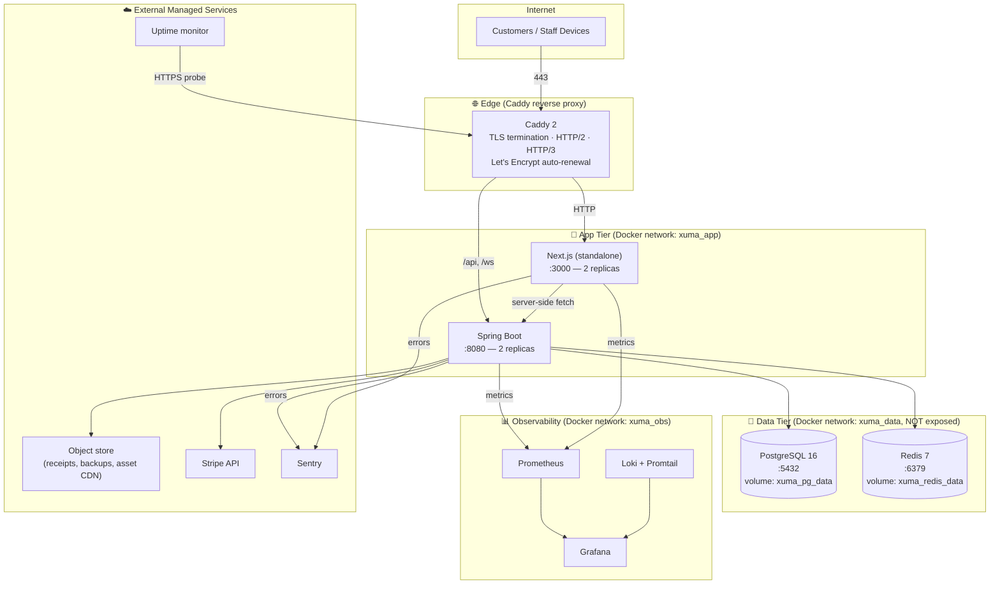
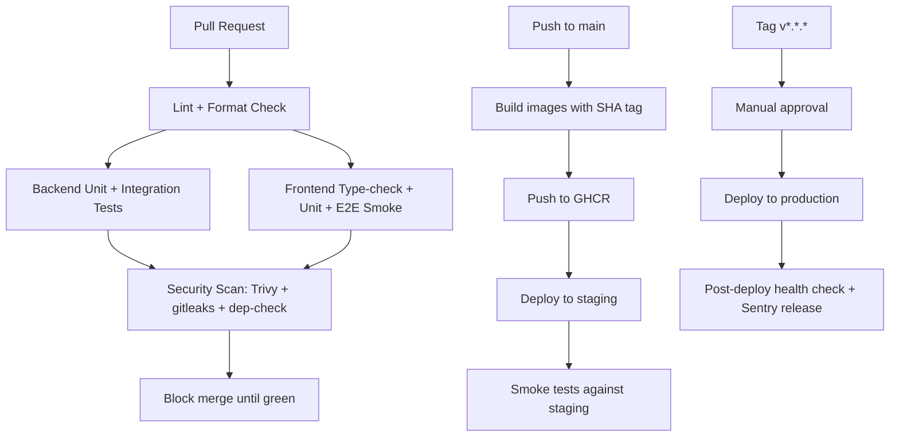

# 🚢 Xuma Restaurant POS — Deployment & Operations Plan

**Role:** Software Architect / Principal Engineer / SRE
**Document:** 5 of 5 — Deployment, CI/CD, Observability, Operations
**Companion files:** `plan_final.md` · `code_architecture.md` · `backend.md` · `frontend.md`

> **For the build agent:** This document defines how Xuma POS is built into images, shipped to production, observed, backed up, and recovered. Treat the production environment as code: every step here lives in a file in the repository, never in someone's head. Where a phase in `backend.md` or `frontend.md` produces an artifact (a Spring Boot fat-jar, a Next.js standalone build), this document defines *what happens next*.

---

## 0. Operating Principles

1. **Reproducible builds.** The same git SHA always produces the same image. Tags are immutable.
2. **Twelve-factor.** All config via environment variables. Secrets injected at runtime, never baked into images.
3. **Statelessness.** App containers store nothing on disk that matters. State lives in PostgreSQL, Redis, and an object store.
4. **Health-checked, graceful, rollable.** Every container exposes `/actuator/health` (backend) or `/api/health` (frontend); deploys wait for `READY` before cutting traffic; the last image stays available for instant rollback.
5. **Observability is non-negotiable.** Logs, metrics, traces, and errors flow to central tools from day one — not after the first incident.
6. **Least privilege everywhere.** Containers run as non-root, networks are segmented, secrets are scoped, the database user used by the app cannot drop tables.

---

## 1. Environments

| Environment | Purpose | Domain (example) | Data | Auto-Deploy |
|---|---|---|---|---|
| `local` | Developer laptops | `localhost` | Seeded dev data, ephemeral | n/a (manual `docker compose up`) |
| `ci` | Pull-request validation | n/a | Fresh PG per test job | Every PR |
| `staging` | Pre-prod mirror, manual QA, Stripe **test mode** | `staging.xuma-pos.nl` | Sanitized snapshot of prod, refreshed weekly | Every push to `main` |
| `production` | Live restaurant | `pos.xuma-pos.nl`, `xuma-restaurant.nl` | Real | Tag push `v*.*.*` after manual approval |

**Rule:** Code reaches production only through `local → CI green → staging → tag → production`. No exceptions, no SSH-and-edit.

---

## 2. Deployment Topology (Single-VPS Baseline)

The restaurant is one site. A single well-sized VPS (4 vCPU / 8 GB RAM / 80 GB SSD, e.g. Hetzner CPX31, DigitalOcean, or Scaleway) is sufficient for years. Architecture is stateless so it can be lifted to two nodes behind a load balancer without code changes.



**Why Caddy, not nginx.** Caddy ships with automatic HTTPS (Let's Encrypt), HTTP/3, sane defaults, and a Caddyfile that is half the size of nginx config. For a single-site restaurant POS the operational simplicity wins decisively.

**Why "managed" S3 + Sentry + Uptime.** State that matters (backups, error traces, uptime signals) must survive the VPS dying. We pay a few euros per month to keep them off-host.

---

## 3. Container Images

### 3.1 Backend Dockerfile (`backend/Dockerfile`)

Multi-stage, distroless, non-root, Java 21 with virtual threads enabled.

```dockerfile
# ---------- Stage 1: build ----------
FROM eclipse-temurin:21-jdk-alpine AS build
WORKDIR /workspace
COPY gradle ./gradle
COPY gradlew settings.gradle.kts build.gradle.kts ./
COPY src ./src
RUN ./gradlew --no-daemon clean bootJar -x test

# ---------- Stage 2: extract layers (Spring Boot layered jar) ----------
FROM eclipse-temurin:21-jre-alpine AS layers
WORKDIR /app
COPY --from=build /workspace/build/libs/*.jar app.jar
RUN java -Djarmode=layertools -jar app.jar extract

# ---------- Stage 3: runtime (distroless) ----------
FROM gcr.io/distroless/java21-debian12:nonroot
WORKDIR /app
COPY --from=layers /app/dependencies/         ./
COPY --from=layers /app/spring-boot-loader/   ./
COPY --from=layers /app/snapshot-dependencies/ ./
COPY --from=layers /app/application/          ./

ENV JAVA_TOOL_OPTIONS="-XX:+UseG1GC -XX:MaxRAMPercentage=70 -XX:+ExitOnOutOfMemoryError -Djava.security.egd=file:/dev/./urandom"
EXPOSE 8080
USER nonroot
ENTRYPOINT ["java", "org.springframework.boot.loader.launch.JarLauncher"]
```

**Why layered jar.** Dependencies change rarely; application classes change every commit. Layering means a typical rebuild reuses ~200 MB of dependency layers and only re-uploads ~5 MB of application code.

**Why distroless.** No shell, no package manager, no `apt`. The attack surface is the JRE and your jar — nothing else. Image size ≈ 220 MB.

### 3.2 Frontend Dockerfile (`frontend/Dockerfile`)

Next.js standalone output, Node 20 LTS, non-root.

```dockerfile
# ---------- Stage 1: deps ----------
FROM node:20-alpine AS deps
WORKDIR /app
COPY package.json package-lock.json ./
RUN npm ci --include=dev

# ---------- Stage 2: build ----------
FROM node:20-alpine AS build
WORKDIR /app
ENV NEXT_TELEMETRY_DISABLED=1
COPY --from=deps /app/node_modules ./node_modules
COPY . .
# Public NEXT_PUBLIC_* vars are baked at build time
ARG NEXT_PUBLIC_API_BASE_URL
ARG NEXT_PUBLIC_WS_URL
ARG NEXT_PUBLIC_STRIPE_PUBLISHABLE_KEY
ENV NEXT_PUBLIC_API_BASE_URL=$NEXT_PUBLIC_API_BASE_URL \
    NEXT_PUBLIC_WS_URL=$NEXT_PUBLIC_WS_URL \
    NEXT_PUBLIC_STRIPE_PUBLISHABLE_KEY=$NEXT_PUBLIC_STRIPE_PUBLISHABLE_KEY
RUN npm run build

# ---------- Stage 3: runtime ----------
FROM node:20-alpine AS runtime
WORKDIR /app
RUN addgroup -S xuma && adduser -S xuma -G xuma
ENV NODE_ENV=production NEXT_TELEMETRY_DISABLED=1 PORT=3000
COPY --from=build --chown=xuma:xuma /app/.next/standalone ./
COPY --from=build --chown=xuma:xuma /app/.next/static ./.next/static
COPY --from=build --chown=xuma:xuma /app/public ./public
USER xuma
EXPOSE 3000
HEALTHCHECK --interval=20s --timeout=3s --start-period=20s --retries=3 \
  CMD wget -qO- http://127.0.0.1:3000/api/health || exit 1
ENTRYPOINT ["node", "server.js"]
```

**Build-time vs runtime env.** `NEXT_PUBLIC_*` is compiled into the JS bundle and *cannot* change without rebuilding. Everything else (server-only, e.g. secrets) is read at runtime. Treat `NEXT_PUBLIC_*` like a versioned interface, not a tunable knob.

Add `next.config.js` setting: `output: 'standalone'`.

### 3.3 `.dockerignore` (both apps)

```
.git
.gitignore
README.md
node_modules
.next
build
out
target
.gradle
.idea
.vscode
*.log
.env
.env.local
coverage
test-results
```

Keep images small and prevent accidental secret leakage.

---

## 4. Production Compose (`docker-compose.prod.yml`)

```yaml
name: xuma

x-restart: &restart
  restart: unless-stopped

x-logging: &logging
  logging:
    driver: json-file
    options: { max-size: "10m", max-file: "5" }

services:
  caddy:
    image: caddy:2-alpine
    <<: [*restart, *logging]
    ports: ["80:80", "443:443", "443:443/udp"]
    volumes:
      - ./caddy/Caddyfile:/etc/caddy/Caddyfile:ro
      - caddy_data:/data
      - caddy_config:/config
    networks: [edge]
    depends_on: [frontend, backend]

  frontend:
    image: ghcr.io/xuma/pos-frontend:${IMAGE_TAG}
    <<: [*restart, *logging]
    env_file: .env.prod.frontend
    networks: [edge, app]
    deploy:
      replicas: 2
      resources: { limits: { cpus: "1.0", memory: 512M } }

  backend:
    image: ghcr.io/xuma/pos-backend:${IMAGE_TAG}
    <<: [*restart, *logging]
    env_file: .env.prod.backend
    networks: [edge, app, data]
    depends_on:
      postgres: { condition: service_healthy }
      redis:    { condition: service_healthy }
    deploy:
      replicas: 2
      resources: { limits: { cpus: "2.0", memory: 1536M } }

  postgres:
    image: postgres:16-alpine
    <<: [*restart, *logging]
    env_file: .env.prod.postgres
    volumes:
      - xuma_pg_data:/var/lib/postgresql/data
      - ./postgres/init:/docker-entrypoint-initdb.d:ro
    networks: [data]
    healthcheck:
      test: ["CMD-SHELL", "pg_isready -U $${POSTGRES_USER} -d $${POSTGRES_DB}"]
      interval: 10s
      timeout: 3s
      retries: 5
    command:
      - "postgres"
      - "-c"
      - "max_connections=100"
      - "-c"
      - "shared_buffers=512MB"
      - "-c"
      - "log_statement=ddl"
      - "-c"
      - "log_min_duration_statement=500"

  redis:
    image: redis:7-alpine
    <<: [*restart, *logging]
    command: ["redis-server", "--appendonly", "yes", "--requirepass", "${REDIS_PASSWORD}"]
    volumes:
      - xuma_redis_data:/data
    networks: [data]
    healthcheck:
      test: ["CMD", "redis-cli", "-a", "${REDIS_PASSWORD}", "ping"]
      interval: 10s
      timeout: 3s
      retries: 5

  prometheus:
    image: prom/prometheus:latest
    <<: [*restart, *logging]
    volumes:
      - ./prometheus/prometheus.yml:/etc/prometheus/prometheus.yml:ro
      - prom_data:/prometheus
    networks: [obs, app]
    command:
      - "--config.file=/etc/prometheus/prometheus.yml"
      - "--storage.tsdb.retention.time=30d"

  grafana:
    image: grafana/grafana:latest
    <<: [*restart, *logging]
    env_file: .env.prod.grafana
    volumes:
      - grafana_data:/var/lib/grafana
      - ./grafana/provisioning:/etc/grafana/provisioning:ro
    networks: [obs, edge]

  loki:
    image: grafana/loki:latest
    <<: [*restart, *logging]
    command: ["-config.file=/etc/loki/local-config.yaml"]
    volumes:
      - loki_data:/loki
    networks: [obs]

  promtail:
    image: grafana/promtail:latest
    <<: [*restart, *logging]
    volumes:
      - /var/log:/var/log:ro
      - /var/lib/docker/containers:/var/lib/docker/containers:ro
      - ./promtail/promtail.yml:/etc/promtail/config.yml:ro
    command: ["-config.file=/etc/promtail/config.yml"]
    networks: [obs]

  backup:
    image: ghcr.io/xuma/pos-backup:latest   # small alpine + pg_dump + restic
    <<: [*restart, *logging]
    env_file: .env.prod.backup
    volumes:
      - xuma_pg_data:/source/pg:ro
      - backup_cache:/cache
    networks: [data]

networks:
  edge: { driver: bridge }
  app:  { driver: bridge, internal: false }
  data: { driver: bridge, internal: true }   # NO outbound internet from data tier
  obs:  { driver: bridge }

volumes:
  xuma_pg_data:
  xuma_redis_data:
  caddy_data:
  caddy_config:
  prom_data:
  grafana_data:
  loki_data:
  backup_cache:
```

**Network segmentation.** The `data` network is `internal: true`. Postgres and Redis cannot reach the internet. If a SQL injection ever opens a remote shell, the attacker is stuck inside a network with no egress.

**Why per-file env_file.** A leak of one file (e.g. Grafana admin password) does not expose database credentials. Granularity costs nothing and limits blast radius.

---

## 5. Reverse Proxy (`caddy/Caddyfile`)

```caddy
{
  email ops@xuma-restaurant.nl
  servers {
    protocols h1 h2 h3
  }
}

# Public marketing + customer site
xuma-restaurant.nl, www.xuma-restaurant.nl {
  encode zstd gzip
  header {
    Strict-Transport-Security "max-age=63072000; includeSubDomains; preload"
    X-Content-Type-Options "nosniff"
    X-Frame-Options "SAMEORIGIN"
    Referrer-Policy "strict-origin-when-cross-origin"
    Permissions-Policy "geolocation=(), microphone=(), camera=()"
    Content-Security-Policy "default-src 'self'; img-src 'self' data: https:; script-src 'self' 'unsafe-inline' https://js.stripe.com; style-src 'self' 'unsafe-inline'; connect-src 'self' https://api.stripe.com wss://pos.xuma-restaurant.nl; frame-src https://js.stripe.com;"
    -Server
  }
  reverse_proxy /api/* backend:8080
  reverse_proxy /ws*   backend:8080
  reverse_proxy        frontend:3000
}

# POS / KDS / Admin — same backend, separate hostname for clarity and CSP
pos.xuma-restaurant.nl {
  encode zstd gzip
  reverse_proxy /api/* backend:8080
  reverse_proxy /ws*   backend:8080 {
    header_up Connection {>Connection}
    header_up Upgrade {>Upgrade}
  }
  reverse_proxy        frontend:3000
}

# Grafana — internal observability, IP-allowlisted
grafana.xuma-restaurant.nl {
  @allowed remote_ip 1.2.3.4/32 5.6.7.8/32   # office IPs only
  handle @allowed { reverse_proxy grafana:3000 }
  respond 403
}
```

**HTTPS is automatic.** Caddy reads the hostnames, requests Let's Encrypt certs, and renews them. No certbot cron jobs to forget.

**HSTS preload note.** Submit the domain to the HSTS preload list only after running with `max-age=63072000; includeSubDomains; preload` for at least a week without issues.

---

## 6. Configuration & Secrets

### 6.1 Env File Inventory

| File | Owner | Contents (examples) | Where stored |
|---|---|---|---|
| `.env.prod.backend` | Backend | `SPRING_PROFILES_ACTIVE=prod`, `DATABASE_URL`, `REDIS_URL`, `JWT_SECRET`, `STRIPE_SECRET_KEY`, `STRIPE_WEBHOOK_SECRET`, `S3_*`, `SENTRY_DSN` | GitHub Actions secret → written at deploy time |
| `.env.prod.frontend` | Frontend | `BACKEND_INTERNAL_URL` (for server components), Sentry, logging | Same |
| `.env.prod.postgres` | Postgres | `POSTGRES_USER`, `POSTGRES_PASSWORD`, `POSTGRES_DB` | Same |
| `.env.prod.grafana` | Grafana | `GF_SECURITY_ADMIN_PASSWORD`, OAuth client if used | Same |
| `.env.prod.backup` | Backup | `RESTIC_PASSWORD`, `RESTIC_REPOSITORY`, `B2_ACCOUNT_*` or `AWS_*` | Same |
| `.env.example` | All | Committed template, real values blank | Git |

### 6.2 Rules

- **Never commit a real secret.** Pre-commit hook runs `gitleaks` to enforce this.
- **Rotate JWT secret every 90 days.** Procedure is documented in §13.
- **Different secrets per environment.** Staging and production never share a `JWT_SECRET`.
- **Reads at startup only.** No runtime fetching of secrets from the env — read once into a typed config bean and pass that around.

### 6.3 Secrets Backend (Future Upgrade Path)

When team size or compliance demands it, swap `.env` files for a secrets manager (Vault, AWS Secrets Manager, Doppler). The Spring Boot side already supports this via `spring.config.import=vault://...` with zero code change.

---

## 7. CI/CD Pipeline (GitHub Actions)

### 7.1 Workflow Map



### 7.2 Required Workflows

```
.github/workflows/
├── pr.yml              # runs on every PR
├── deploy-staging.yml  # runs on push to main
├── deploy-prod.yml     # runs on tag v*.*.*
└── backup-verify.yml   # nightly restore-test of latest backup
```

### 7.3 PR Workflow (`pr.yml`) — Essentials

```yaml
name: PR Validation
on:
  pull_request:
    branches: [main]

concurrency:
  group: pr-${{ github.head_ref }}
  cancel-in-progress: true

jobs:
  backend:
    runs-on: ubuntu-latest
    services:
      postgres:
        image: postgres:16-alpine
        env: { POSTGRES_PASSWORD: test, POSTGRES_DB: xuma_test }
        ports: ["5432:5432"]
        options: --health-cmd pg_isready --health-interval 5s
      redis:
        image: redis:7-alpine
        ports: ["6379:6379"]
    steps:
      - uses: actions/checkout@v4
      - uses: actions/setup-java@v4
        with: { distribution: temurin, java-version: 21, cache: gradle }
      - run: ./gradlew --no-daemon check
      - uses: github/codeql-action/upload-sarif@v3
        if: always()
        with: { sarif_file: backend/build/reports/spotbugs.sarif }

  frontend:
    runs-on: ubuntu-latest
    steps:
      - uses: actions/checkout@v4
      - uses: actions/setup-node@v4
        with: { node-version: 20, cache: npm }
      - run: npm ci
      - run: npm run typecheck
      - run: npm run lint
      - run: npm test -- --coverage
      - run: npx playwright install --with-deps chromium
      - run: npm run test:e2e:smoke

  security:
    runs-on: ubuntu-latest
    needs: [backend, frontend]
    steps:
      - uses: actions/checkout@v4
      - uses: gitleaks/gitleaks-action@v2
      - uses: aquasecurity/trivy-action@master
        with: { scan-type: fs, ignore-unfixed: true, severity: HIGH,CRITICAL, exit-code: 1 }
```

### 7.4 Production Deploy Workflow (`deploy-prod.yml`) — Essentials

```yaml
name: Deploy to Production
on:
  push:
    tags: ["v*.*.*"]

jobs:
  build-and-push:
    runs-on: ubuntu-latest
    permissions: { contents: read, packages: write, id-token: write }
    outputs:
      tag: ${{ steps.meta.outputs.version }}
    steps:
      - uses: actions/checkout@v4
      - uses: docker/setup-buildx-action@v3
      - uses: docker/login-action@v3
        with: { registry: ghcr.io, username: ${{ github.actor }}, password: ${{ secrets.GITHUB_TOKEN }} }
      - id: meta
        run: echo "version=${GITHUB_REF_NAME}" >> $GITHUB_OUTPUT
      - uses: docker/build-push-action@v5
        with:
          context: ./backend
          push: true
          tags: |
            ghcr.io/xuma/pos-backend:${{ steps.meta.outputs.version }}
            ghcr.io/xuma/pos-backend:latest
          cache-from: type=gha
          cache-to:   type=gha,mode=max
          provenance: true
          sbom: true
      - uses: docker/build-push-action@v5
        with:
          context: ./frontend
          push: true
          build-args: |
            NEXT_PUBLIC_API_BASE_URL=${{ vars.NEXT_PUBLIC_API_BASE_URL }}
            NEXT_PUBLIC_WS_URL=${{ vars.NEXT_PUBLIC_WS_URL }}
            NEXT_PUBLIC_STRIPE_PUBLISHABLE_KEY=${{ secrets.STRIPE_PUBLISHABLE_KEY }}
          tags: |
            ghcr.io/xuma/pos-frontend:${{ steps.meta.outputs.version }}
            ghcr.io/xuma/pos-frontend:latest

  deploy:
    runs-on: ubuntu-latest
    needs: build-and-push
    environment:
      name: production
      url: https://pos.xuma-restaurant.nl
    steps:
      - uses: actions/checkout@v4
      - name: Configure SSH
        run: |
          mkdir -p ~/.ssh && echo "${{ secrets.PROD_SSH_KEY }}" > ~/.ssh/id_ed25519
          chmod 600 ~/.ssh/id_ed25519
          ssh-keyscan -H ${{ secrets.PROD_HOST }} >> ~/.ssh/known_hosts
      - name: Roll out
        env:
          IMAGE_TAG: ${{ needs.build-and-push.outputs.tag }}
        run: |
          ssh deploy@${{ secrets.PROD_HOST }} \
            "cd /srv/xuma && \
             export IMAGE_TAG=${IMAGE_TAG} && \
             docker compose -f docker-compose.prod.yml pull && \
             docker compose -f docker-compose.prod.yml up -d --no-deps --remove-orphans backend frontend && \
             ./scripts/wait-healthy.sh backend frontend"
      - name: Smoke test
        run: |
          curl -fsSL https://pos.xuma-restaurant.nl/api/actuator/health | grep -q '"status":"UP"'
          curl -fsSL https://pos.xuma-restaurant.nl/api/health        | grep -q ok
      - name: Notify Sentry of release
        uses: getsentry/action-release@v1
        env:
          SENTRY_AUTH_TOKEN: ${{ secrets.SENTRY_AUTH_TOKEN }}
          SENTRY_ORG: xuma
        with:
          environment: production
          version: ${{ needs.build-and-push.outputs.tag }}
```

### 7.5 Blue/Green via Compose

`docker compose up -d --no-deps backend frontend` performs a rolling restart: it brings new containers up, waits for healthchecks, then removes the old ones. With two replicas behind Caddy the user-visible downtime is zero. The `scripts/wait-healthy.sh` script blocks until every replica reports `HEALTHY` before the workflow declares success.

---

## 8. Database Migrations in Production

### 8.1 Flyway Strategy

- Migrations live under `backend/src/main/resources/db/migration`, named `V<phase>_<order>__<description>.sql` (per `backend.md` §1).
- Flyway runs **on application startup**. The first replica acquires the migration lock; the second waits. This is safe because Spring Boot's Flyway integration uses `pg_advisory_lock`.
- `baseline-on-migrate: true` is set only on **fresh production bring-up** to mark the existing schema as baseline. Remove it from config afterwards.
- **No backward-incompatible migrations in a single deploy.** Expand → migrate → contract is the rule (see §8.2).

### 8.2 Expand–Migrate–Contract Pattern

A schema change that breaks the running code requires three deploys:

1. **Expand:** add the new column/table, dual-write code, old reads still work.
2. **Backfill:** one-off migration populates new column from old data.
3. **Contract:** remove the old column/table after a release cycle confirms no rollback is needed.

Example — renaming `customer_note` to `note` on `orders`:

```sql
-- V14_01__add_orders_note.sql  (expand)
ALTER TABLE orders ADD COLUMN note TEXT;
UPDATE orders SET note = customer_note WHERE note IS NULL;
-- code now writes both columns, reads `note` with COALESCE

-- V15_01__drop_orders_customer_note.sql  (contract, next release)
ALTER TABLE orders DROP COLUMN customer_note;
```

### 8.3 Long Migrations

Anything that takes > 5 seconds on the production dataset (e.g., adding an index on `orders` after a year of trading) must run **outside the deploy window**:

```sql
-- V20_01__idx_orders_created_at.sql
CREATE INDEX CONCURRENTLY idx_orders_created_at ON orders (created_at DESC);
```

`CREATE INDEX CONCURRENTLY` cannot run inside a transaction, so set it in a dedicated migration file marked with the Flyway property `transactional: false` via `db/migration/V20_01__idx_orders_created_at.sql.conf`.

---

## 9. Backup & Disaster Recovery

### 9.1 Backup Targets and Schedule

| Asset | Tool | Schedule | Retention | Destination |
|---|---|---|---|---|
| PostgreSQL logical dump | `pg_dump` (custom format) → `restic` | Hourly (last 24) + daily (last 30) + weekly (last 12) | Hot off-host (S3-compatible, e.g. Backblaze B2) |
| PostgreSQL WAL archive | `pg_basebackup` + WAL-G | Continuous | 7 days | Same |
| Receipts / uploaded images | App writes directly to S3 with versioning | Continuous | 7 years (tax law) | S3 with object-lock |
| Redis | `redis-cli SAVE` snapshot | Daily | 7 days | S3 |
| Docker volumes (Grafana dashboards, Caddy certs) | tar + restic | Daily | 14 days | S3 |
| Application logs | Loki → S3 cold | Continuous | 30 days hot, 1 year cold | S3 |

### 9.2 Backup Container

The `backup` service in `docker-compose.prod.yml` runs a small cron-like loop:

```sh
# /backup/entrypoint.sh (illustrative)
while true; do
  TS=$(date -u +%Y%m%dT%H%M%SZ)
  pg_dump -h postgres -U "$PGUSER" -Fc "$PGDATABASE" > /cache/dump-$TS.pgdump
  restic backup /cache/dump-$TS.pgdump --tag hourly
  restic forget --keep-hourly 24 --keep-daily 30 --keep-weekly 12 --prune
  rm /cache/dump-*.pgdump
  sleep 3600
done
```

### 9.3 Restore Drill — Quarterly

A backup that has never been restored is not a backup. **Once a quarter** the on-call engineer runs:

```bash
# 1. Spin up an empty Postgres container with the backup volume mounted
# 2. restic restore --target=/restore latest
# 3. pg_restore --create --dbname=postgres /restore/cache/dump-*.pgdump
# 4. Boot the backend pointing at the restored DB
# 5. Run end-to-end smoke tests
# 6. Tear it down, file the drill report
```

The `backup-verify.yml` workflow automates a smaller version of this nightly against the latest dump.

### 9.4 RPO / RTO Targets

| Scenario | Recovery Point Objective | Recovery Time Objective |
|---|---|---|
| Single container crash | 0 (in-memory state) | < 30 s (auto-restart) |
| VPS dies | ≤ 1 hour (last hourly dump) | < 2 hours (provision new VPS, restore, DNS swap) |
| Region outage | ≤ 1 hour | < 4 hours |
| Corrupt data caught after 24h | ≤ 24 hours (daily dump) | < 1 hour to restore |
| Ransomware / total compromise | ≤ 24 hours (immutable off-host) | < 4 hours |

DNS records use a low TTL (300 s) so failover is fast.

---

## 10. Observability

### 10.1 Three Pillars

| Pillar | Tool | What it answers |
|---|---|---|
| **Metrics** | Prometheus + Grafana | "Is the system healthy *right now*?" — latency, error rate, throughput, CPU/RAM, DB connection pool, JVM heap, Redis hit rate |
| **Logs** | Loki + Promtail + Grafana | "What exactly happened?" — searchable structured logs across all containers |
| **Errors** | Sentry | "Who broke what?" — exception traces with release tags, breadcrumbs, user context |
| **Uptime** | External monitor (BetterStack / UptimeRobot) | "Is the site reachable from the internet?" — independent of the host itself |
| **Traces** (optional later) | Grafana Tempo + Micrometer Tracing | "Where did the 300 ms go?" — per-request distributed trace |

### 10.2 Backend Metrics Configuration

Spring Boot exposes Micrometer metrics at `/actuator/prometheus`. Configure:

```yaml
management:
  endpoints:
    web:
      exposure:
        include: health,info,prometheus,metrics
      base-path: /actuator
  endpoint:
    health:
      show-details: when-authorized
      probes: { enabled: true }
  metrics:
    tags: { application: xuma-pos, env: ${SPRING_PROFILES_ACTIVE} }
    distribution:
      percentiles-histogram:
        http.server.requests: true
      slo:
        http.server.requests: 50ms,200ms,500ms
```

Custom business metrics published with `MeterRegistry`:

| Metric | Type | Use |
|---|---|---|
| `xuma.orders.created.total` | Counter | Orders per hour, peak detection |
| `xuma.orders.transition.duration` | Timer (tagged `from`, `to`) | How long PENDING → PREPARING takes |
| `xuma.payments.processed.total` | Counter (tagged `method`, `status`) | Stripe vs cash mix, failure rate |
| `xuma.kitchen.queue.depth` | Gauge | Real-time KDS load |
| `xuma.menu.cache.hit.ratio` | Gauge | Redis effectiveness |
| `xuma.ws.connections.active` | Gauge | Live POS/KDS sessions |

### 10.3 Frontend Metrics

Next.js exposes Web Vitals via `useReportWebVitals`. Push them to the backend, which forwards to Prometheus:

```ts
// frontend/app/web-vitals.tsx
'use client';
import { useReportWebVitals } from 'next/web-vitals';
export function WebVitals() {
  useReportWebVitals((metric) => {
    navigator.sendBeacon('/api/telemetry/web-vital', JSON.stringify(metric));
  });
  return null;
}
```

Track LCP, INP, CLS, TTFB. Grafana panel: weekly trend of LCP p75 — must stay below 2.5s on cellular.

### 10.4 Logging Standards

- **Format:** JSON, one event per line, via `logstash-logback-encoder`.
- **Required fields:** `timestamp`, `level`, `logger`, `message`, `trace_id`, `user_id` (if authenticated), `request_id`.
- **Never log:** passwords, JWTs, refresh tokens, full credit card numbers, Stripe secret keys. Use `@JsonIgnore` or masking filters.
- **Sampling:** `INFO` and above always; `DEBUG` only when `LOGGING_LEVEL_COM_XUMA=DEBUG` is set at runtime for troubleshooting.

### 10.5 Alerting Rules (Prometheus → Alertmanager → Slack/PagerDuty)

| Alert | Condition | Severity |
|---|---|---|
| `BackendDown` | `up{job="backend"} == 0` for 2 min | Critical (page) |
| `HighErrorRate` | 5xx rate > 1% over 5 min | Critical (page) |
| `HighLatency` | http p95 > 1s over 10 min | Warning (Slack) |
| `DBConnectionsExhausted` | `hikaricp_connections_active / hikaricp_connections_max > 0.9` for 5 min | Critical |
| `DiskSpaceLow` | free < 15% | Warning |
| `DiskSpaceCritical` | free < 5% | Critical (page) |
| `RedisDown` | redis up == 0 for 1 min | Critical |
| `BackupFailed` | `xuma_backup_last_success_age_seconds > 90000` (25h) | Critical |
| `CertExpiringSoon` | < 14 days to expiry | Warning |
| `OrderQueueStalled` | `xuma_kitchen_queue_depth` non-zero AND `xuma_orders_transition_total` rate == 0 over 10 min | Warning (something broke between KDS and backend) |

---

## 11. Security Hardening Checklist (Infrastructure Layer)

This complements the application-layer security in `backend.md` Phase 5. Both are required.

### 11.1 Host Hardening
- [ ] SSH: password auth disabled, key-only, non-default port optional but `fail2ban` enabled
- [ ] Firewall: only 22 (key-only), 80, 443 open externally. Everything else loopback or Docker network only.
- [ ] Automatic security updates: `unattended-upgrades` enabled
- [ ] Non-root deploy user with `sudo` only for restart commands
- [ ] Docker socket not exposed over TCP, not bind-mounted into any non-trusted container
- [ ] Host time synced (`chrony` / `systemd-timesyncd`) — JWT validation depends on it

### 11.2 Container Hardening
- [ ] All app containers run as non-root (verified by `docker exec ... id`)
- [ ] `read_only: true` filesystem where possible, with explicit tmpfs mounts for write paths
- [ ] `cap_drop: [ALL]` then `cap_add` only what is needed (usually nothing)
- [ ] No `--privileged`. No `host` network. No bind-mounted `/`.
- [ ] Image scanning: Trivy in CI blocks HIGH/CRITICAL CVEs
- [ ] Base images pinned by SHA, not by floating tag (`alpine@sha256:...`) in production

### 11.3 Network Hardening
- [ ] `data` network is `internal: true` — Postgres and Redis have no egress
- [ ] Database password rotated quarterly, app uses a role that cannot `DROP` or `TRUNCATE`
- [ ] Redis bound to internal network only, password-protected
- [ ] Stripe webhook endpoint validates signature *before* doing any work (see `backend.md` Phase 5)
- [ ] CORS: only `https://xuma-restaurant.nl` and `https://pos.xuma-restaurant.nl` allowed
- [ ] WebSocket: SameOrigin check + JWT in CONNECT frame (per `backend.md` Phase 4)

### 11.4 Secrets Hygiene
- [ ] No secrets in image layers (verified with `dive` or `docker history`)
- [ ] No secrets in container env vars visible to non-deploy users (`/proc/<pid>/environ` chmod-protected)
- [ ] `gitleaks` pre-commit hook on every developer machine + in CI
- [ ] GitHub Actions secrets scoped to `production` environment with required reviewers
- [ ] Audit log of secret access (GitHub provides this for Actions secrets)

### 11.5 Data Protection (GDPR — EU/NL)
- [ ] Customer data export endpoint (`GET /api/customers/me/export`) returns JSON of everything held
- [ ] Right-to-be-forgotten endpoint anonymises personal data on orders (replaces name/email/phone with `<deleted-USERID>`, keeps order history for tax records)
- [ ] Cookie consent banner with granular controls; analytics blocked until consent given
- [ ] Privacy policy and DPA links in footer
- [ ] Backups encrypted at rest (`restic` handles this with `RESTIC_PASSWORD`)

---

## 12. Provisioning Runbook (Fresh VPS → Running App)

This is the single source of truth for setting up the production host. Should fit on one page.

```bash
# 1. Provision VPS (Ubuntu 24.04 LTS, 4 vCPU / 8 GB RAM / 80 GB SSD)
# 2. SSH in as root, create deploy user
adduser --disabled-password --gecos "" deploy && usermod -aG sudo deploy
mkdir -p /home/deploy/.ssh && cp ~/.ssh/authorized_keys /home/deploy/.ssh/ && chown -R deploy:deploy /home/deploy/.ssh

# 3. Harden SSH (as root)
sed -i 's/^#\?PermitRootLogin.*/PermitRootLogin no/; s/^#\?PasswordAuthentication.*/PasswordAuthentication no/' /etc/ssh/sshd_config && systemctl restart ssh

# 4. Firewall
ufw default deny incoming && ufw default allow outgoing && ufw allow 22/tcp && ufw allow 80/tcp && ufw allow 443/tcp && ufw allow 443/udp && ufw --force enable

# 5. Docker
curl -fsSL https://get.docker.com | sh && usermod -aG docker deploy

# 6. Project layout (as deploy user)
sudo -iu deploy
mkdir -p /srv/xuma/{caddy,prometheus,grafana/provisioning,promtail,postgres/init,scripts} && cd /srv/xuma

# 7. Pull deploy-only files from repo (compose, configs, NOT source code)
git clone --depth=1 --filter=blob:none --sparse https://github.com/xuma/pos.git .deploy && cd .deploy && git sparse-checkout set deploy && cp -r deploy/* ../ && cd .. && rm -rf .deploy

# 8. Place secrets (.env.prod.* files copied securely via SSH/scp from a trusted machine — never committed)
# 9. Login to GHCR
echo "$GHCR_PAT" | docker login ghcr.io -u xuma --password-stdin

# 10. First deploy
export IMAGE_TAG=v0.1.0
docker compose -f docker-compose.prod.yml up -d

# 11. Verify
./scripts/wait-healthy.sh
curl -fsSL https://pos.xuma-restaurant.nl/api/actuator/health
```

Every command is idempotent; rerun-safe. The full script lives in `scripts/provision.sh`.

---

## 13. Routine Operations Runbooks

Each runbook is one page, lives in `docs/runbooks/`, and is linked from the relevant Grafana alert annotation.

### 13.1 Rolling Restart

```bash
ssh deploy@prod "cd /srv/xuma && docker compose restart backend frontend"
# Caddy keeps serving via the healthy replica during each container's restart
```

### 13.2 Rollback to Previous Version

```bash
ssh deploy@prod "cd /srv/xuma && IMAGE_TAG=<previous-tag> docker compose pull backend frontend && IMAGE_TAG=<previous-tag> docker compose up -d --no-deps backend frontend"
```

If the previous version had an incompatible schema, see §8.2 — you must have followed expand–contract for rollback to be safe.

### 13.3 JWT Secret Rotation (Zero-Downtime)

The backend supports two secrets simultaneously (`JWT_SECRET` for signing, `JWT_SECRET_PREVIOUS` for validating). Procedure:

1. Generate new secret: `openssl rand -base64 64`
2. Deploy with `JWT_SECRET=<new>` and `JWT_SECRET_PREVIOUS=<old>`
3. Wait > access-token lifetime (15 min) + refresh-token lifetime (7 days), or accept that users with old refresh tokens will need to log in again
4. Deploy again with `JWT_SECRET_PREVIOUS` removed

### 13.4 Scale Up (Single Host → Two Hosts)

When peak load justifies it:

1. Move Postgres to managed (RDS, Crunchy Bridge, Supabase) — one-time `pg_dump` + restore
2. Move Redis to managed (Upstash, ElastiCache)
3. Provision second VPS, replicate Caddy + app containers, point both at the managed data
4. DNS round-robin or external load balancer (Cloudflare, Hetzner LB) in front
5. Sticky sessions **not required** — JWT is stateless, WebSocket reconnects gracefully

### 13.5 Stripe Webhook Outage

If Stripe webhooks stop arriving (visible as zero `xuma.payments.webhook.received` rate):

1. Check Stripe dashboard → Developers → Webhooks → endpoint status
2. Replay missed events from the dashboard (last 30 days available)
3. The `stripe_events` table's idempotency check (`backend.md` Phase 5) ensures replays are safe

### 13.6 Database Bloat / Slow Queries

Quarterly task:

```sql
-- Identify slowest queries
SELECT query, calls, mean_exec_time, total_exec_time
FROM pg_stat_statements
ORDER BY total_exec_time DESC
LIMIT 20;

-- Identify table bloat
SELECT relname, n_live_tup, n_dead_tup, last_autovacuum
FROM pg_stat_user_tables
ORDER BY n_dead_tup DESC;

-- If a table needs it (rare with autovacuum)
VACUUM (VERBOSE, ANALYZE) orders;
```

---

## 14. Capacity Planning Snapshot

Sizing for a single restaurant with up to ~500 covers/day, two POS terminals, one KDS, one admin user, customers browsing the site.

| Resource | Estimate | Headroom on baseline VPS (4 vCPU / 8 GB) |
|---|---|---|
| Concurrent active users | < 50 sustained, ~200 spike | 10× headroom |
| Orders / hour peak | ~80 | < 1% CPU |
| API requests / second | ~30 sustained, 150 spike | 10× headroom |
| WebSocket connections | ~10 (terminals + admin + customer trackers) | 1000× headroom |
| DB rows / year (orders + items) | ~150 k orders + ~600 k items | < 1 GB |
| Receipts (PDFs) / year | ~150 k @ ~30 KB = 4.5 GB | stored on S3 |

The baseline VPS will be heavily under-utilised for years. Resource limits in compose exist to *contain* runaway processes, not to fit a budget.

---

## 15. Definition of Done — Deployment Layer

A release reaches "deployed" status only when **all** of the following are true:

- [ ] CI is fully green on the tagged commit
- [ ] Images are pushed to GHCR with both `:version` and `:latest` tags
- [ ] SBOM and build provenance attached to each image
- [ ] Trivy scan shows no HIGH/CRITICAL vulnerabilities
- [ ] Staging deploy succeeded and smoke tests passed
- [ ] Production deploy succeeded; both backend replicas report `UP`
- [ ] Synthetic smoke test (login → create order → pay test card → see receipt) passes on production
- [ ] Sentry release marker created
- [ ] Grafana annotation added with the version tag
- [ ] No new alerts fired in the 30-minute post-deploy window
- [ ] Deploy notes posted to the team channel

If any of the above fails, the rollback runbook (§13.2) is executed before further debugging.

---

## 16. Appendix — Useful One-Liners

```bash
# Tail backend logs in real time
ssh deploy@prod "docker compose logs -f --tail=200 backend"

# Connect to production psql (only from a host with VPN / SSH tunnel)
ssh -L 5432:postgres:5432 deploy@prod   # then in another terminal: psql -h localhost

# Trigger a one-off database dump
ssh deploy@prod "docker compose exec backup /backup/once.sh"

# Hot-reload Caddy after editing Caddyfile
ssh deploy@prod "docker compose exec caddy caddy reload --config /etc/caddy/Caddyfile"

# See resource usage of every container
ssh deploy@prod "docker stats --no-stream"

# Verify image signatures (when cosign is set up)
cosign verify --certificate-identity-regexp '.*github.*' ghcr.io/xuma/pos-backend:v1.0.0
```

---

*End of Document 5 — Deployment & Operations. Together with `plan_final.md`, `code_architecture.md`, `backend.md`, and `frontend.md`, this completes the build-ready specification set.*
