# 🚀 Xuma Restaurant POS — Master Implementation Plan

**Role:** Software Architect / Principal Engineer
**Document:** 1 of 5 — Master Plan (Backend-First, 10 Phases)
**Stack:** Spring Boot 3.2+ (Java 21) · Next.js 14+ (TypeScript) · PostgreSQL 16 · Redis 7 · Docker

> **For the build agent:** This is the single source of truth for *what to build, when, and in what order*. Architecture rules live in `code_architecture.md`. Backend phase details live in `backend.md`. Frontend phase details live in `frontend.md`. Deployment lives in `deployment.md`. Read all five together. Use entity, package, and role names *exactly* as written across documents.

---

## 0. Executive Summary

Xuma POS is a single-application restaurant point-of-sale and customer site for a refined waterfront restaurant in Goes, Zeeland. One Spring Boot backend, one Next.js frontend, PostgreSQL for state, Redis for cache and tokens. Built **backend-first**: every API exists and is integration-tested before any frontend screen consumes it. This trades a bit of early visual feedback for a rock-solid foundation and zero re-work on the frontend.

| Concern | Decision | Rationale |
|---|---|---|
| Build order | **Backend first (P1–P5), then Frontend (P6–P10)** | Real APIs from day one, no mock drift, no contract gaps |
| Architecture | **Lite-DDD Package-by-Feature** | Rich domain models, no hexagonal ceremony |
| Auth | **Spring Security 6 + JWT** (no Keycloak) | Single app, manual RBAC is simpler to own |
| Real-time | **STOMP over WebSocket** | Bidirectional kitchen/POS sync |
| Persistence | **PostgreSQL + Flyway** | ACID, predictable migrations |
| Cache | **Redis** | Menu cache, refresh-token store, rate limiting |
| Frontend | **Next.js 14+ App Router, TypeScript, Tailwind** | SSR speed, route-level guards |
| State (FE) | **Zustand + TanStack Query** | Local UI state + server cache, no Redux ceremony |
| Mapping | **MapStruct + Lombok** | Zero boilerplate, compile-time safe |
| Testing | **JUnit 5 + Testcontainers (BE); Vitest + Playwright (FE)** | Real PostgreSQL/Redis in tests, real browser E2E |
| Deployment | **Docker + docker-compose** | One command up, identical envs |

---

## 1. The 10 Phases at a Glance

```mermaid
gantt
    title Xuma POS — 10-Phase Roadmap
    dateFormat  X
    axisFormat %s
    section Backend
    P1 Foundation              :p1, 0, 1
    P2 Identity & Security     :p2, after p1, 1
    P3 Menu & Catalog          :p3, after p2, 1
    P4 Orders & Real-Time      :p4, after p3, 1
    P5 Tables/Payments/Reports :p5, after p4, 1
    section Frontend
    P6 Foundation & UI Kit     :p6, after p5, 1
    P7 Auth & Public Site      :p7, after p6, 1
    P8 POS Terminal            :p8, after p7, 1
    P9 KDS & Real-Time         :p9, after p8, 1
    P10 Admin, Reports, Prod   :p10, after p9, 1
```



| # | Phase | Domain | Document | Definition of Done |
|---|---|---|---|---|
| **1** | Foundation & Infrastructure | Backend | `backend.md §1` | App boots, PG+Redis connected, Flyway runs, health check green, global exception handler returns `ApiResponse`, Docker compose up |
| **2** | Identity, Auth & RBAC | Backend | `backend.md §2` | Register/login/refresh/logout endpoints live, JWT issued and validated, `@PreAuthorize` works, Google OAuth2 social login working, rate limit on `/auth/**` |
| **3** | Menu & Catalog | Backend | `backend.md §3` | Category/MenuItem/Allergen CRUD, Redis caching with eviction, image URL handling, public read endpoints, admin write endpoints |
| **4** | Orders & Real-Time | Backend | `backend.md §4` | Order create/update/cancel, state machine enforced, WebSocket `/topic/orders/**` broadcasting, idempotency on create, OrderItem cascade |
| **5** | Tables, Payments, Reports & Hardening | Backend | `backend.md §5` | Table status, reservations, Stripe integration with webhook verification, receipts, report aggregates, rate limiting, Actuator, security review |
| **6** | Frontend Foundation & UI Kit | Frontend | `frontend.md §1` | Next.js scaffolded, Tailwind + design tokens wired, Fraunces + Hanken Grotesk loaded via `next/font`, shadcn primitives restyled, Storybook-ready UI library |
| **7** | Authentication & Public Site | Frontend | `frontend.md §2` | Login/register/OAuth flows, HttpOnly-cookie token storage, middleware route guards, public home, menu (filterable), reservation form |
| **8** | POS Terminal | Frontend | `frontend.md §3` | Two-panel POS (menu grid + cart), table picker, hold/split/discount, Stripe Elements, receipt print/email, optimistic UI |
| **9** | KDS & Real-Time Wiring | Frontend | `frontend.md §4` | Kitchen display with color-coded wait times, STOMP client, live ticket queue, real-time status sync to POS and customer tracking |
| **10** | Admin, Reports & Production | Frontend + Deploy | `frontend.md §5`, `deployment.md` | Admin menu/staff CRUD, dashboards (revenue, top items), skeletons, error boundaries, WCAG AA pass, prod Docker, CI/CD, observability |

Each phase ships a vertical slice — schema → backend → tested. No half-done features carried between phases.

---

## 2. Bounded Contexts (Ubiquitous Language)

All packages and team conversations use these terms exactly. No synonyms drift.

| Context | Terms |
|---|---|
| **Identity** | User, Role, Permission, RefreshToken, Provider (LOCAL/GOOGLE) |
| **Profile** | Staff (employee), Customer (loyalty) |
| **Catalog** | Category, MenuItem, Allergen, "86'd" = unavailable |
| **Ordering** | Order, OrderItem, Ticket (kitchen's view of an Order), State Machine, Settle (= pay & close) |
| **Floor** | RestaurantTable, Reservation, Section (INDOOR/OUTDOOR/BAR/PRIVATE) |
| **Billing** | Payment, Receipt, Method (CASH/CARD/SPLIT/VOUCHER) |
| **Reporting** | Daily/Weekly/Monthly aggregates, KPI |

Each context maps to exactly one Java package (`com.xuma.pos.<context>`) and one frontend route group.

---

## 3. Cross-Phase Quality Gates

Before any phase is marked done, **all** of these must be true:

```
✅  Compiles cleanly with zero warnings
✅  All new code covered by tests (≥ 80% line coverage on services, 100% on state machines)
✅  No entities crossing controller boundaries (DTOs only)
✅  No business logic in controllers
✅  Every protected endpoint has @PreAuthorize
✅  All inputs validated with @Valid + Bean Validation
✅  Flyway migration committed (never edit applied migrations)
✅  OpenAPI spec auto-generated and committed
✅  README updated with any new env vars
✅  No TODOs without a ticket reference
```

---

## 4. The Definition of "Industry Standard" Here

> Senior engineers know the difference between *clever* and *correct*. This project chooses correct.

| Choice | Why |
|---|---|
| Records for DTOs | Immutable, no setters, no boilerplate |
| Constructor injection (final fields) | Testable, immutable, no field injection |
| `@Transactional` only on services | Clear transaction boundaries |
| MapStruct over manual mappers | Compile-time safety, no runtime reflection |
| Flyway over Liquibase | Plain SQL is readable by everyone |
| `application.yml` over `.properties` | Hierarchical, supports profiles cleanly |
| Java Time API (`Instant`, `LocalDate`) only | No `Date`, no `Calendar`, ever |
| `BigDecimal` for all money | Never `double` for currency |
| Optional return for "find by id" | Forces null-checking at call site |
| Specific exceptions over generic | `OrderNotFoundException`, not `RuntimeException` |
| Pagination on all list endpoints | `Page<T>` always, no unbounded lists |
| Audit columns on every entity | `createdAt`, `updatedAt`, `createdBy` |

---

## 5. What Each Document Covers (Read in This Order)

| # | File | Contains | Read When |
|---|---|---|---|
| 1 | **plan_final.md** *(this)* | Phase roadmap, scope, decisions | First — gives the whole map |
| 2 | **code_architecture.md** | Package layout, layers, patterns, naming, both BE and FE | Before writing any code |
| 3 | **backend.md** | Phases 1–5 step-by-step, every entity/endpoint/service detailed | Building backend |
| 4 | **frontend.md** | Phases 6–10 step-by-step, components, hooks, state, WS client | Building frontend |
| 5 | **deployment.md** | Docker, compose, CI/CD, observability, prod hardening | At phase 5 and again at phase 10 |

The original specification documents (`01_system_design.md`, `02_class_diagram.md`, `03_entity_management.md`, `06_design_system.md`, `07_color_system.md`) remain authoritative for *what* the system is. These five new documents define *how to build it*.

---

## 6. Phase-Entry Checklists

### Entering Phase 1 (start of project)
- [ ] Java 21 installed (`java -version`)
- [ ] Docker + Docker Compose installed
- [ ] Node 20+ installed (for later phases)
- [ ] PostgreSQL 16 image pulls successfully
- [ ] Git repo initialized with `.gitignore` (Java + Node + IntelliJ + VS Code)
- [ ] Read `code_architecture.md` end-to-end

### Entering Phase 6 (frontend kickoff)
- [ ] All backend integration tests passing
- [ ] OpenAPI spec exported and reviewed
- [ ] Postman collection or HTTP file confirms every endpoint works against a running BE
- [ ] At least one happy-path E2E manually exercised: register → login → create order → pay → see status

### Entering Phase 10 (production prep)
- [ ] All unit + integration tests green
- [ ] Lighthouse ≥ 90 on all public pages
- [ ] No console errors in any flow
- [ ] All copy reviewed in NL and EN
- [ ] Stripe in test mode end-to-end works

---

## 7. Risk Register & Mitigations

| Risk | Mitigation |
|---|---|
| Schema drift between FE types and BE DTOs | Auto-generate TypeScript types from OpenAPI spec in CI |
| WebSocket reconnect storms | Exponential backoff in STOMP client, max 5 retries, then surface "reconnecting" UI |
| JWT secret leakage | Secret from env only, rotated quarterly, never logged |
| Order state corruption | State machine enforced in entity *and* service; both throw on illegal transitions |
| Stripe webhook replay | Idempotency key on `Payment`, signature verification, persisted webhook log |
| Menu cache staleness | Evict on every write; cache key versioning if needed |
| Refresh token theft | Rotation on every use, family-tracking, revoke entire family on reuse detection |
| Long-running DB queries on reports | Pre-aggregated materialized views, indexed on `created_at` |
| WCAG regressions | Axe checks in CI for all public pages |
| Cold-start latency | Spring Boot AOT optionally; keep instances warm |

---

## 8. Done Means Done

The system is production-ready when:

1. A waiter can take an order on tablet → kitchen sees it instantly → cashier settles it → receipt issued → table freed.
2. A customer can browse the menu in NL or EN, reserve a table, and pay online.
3. An admin can add a menu item, see today's revenue, and disable an item that's 86'd.
4. The KDS shows orders color-coded by wait time and tickets disappear when served.
5. All of the above works on a phone, a tablet, and a desktop.
6. None of the above requires a developer to be online to recover.

---

*End of Document 1 — Master Plan. Continue with `code_architecture.md`.*
